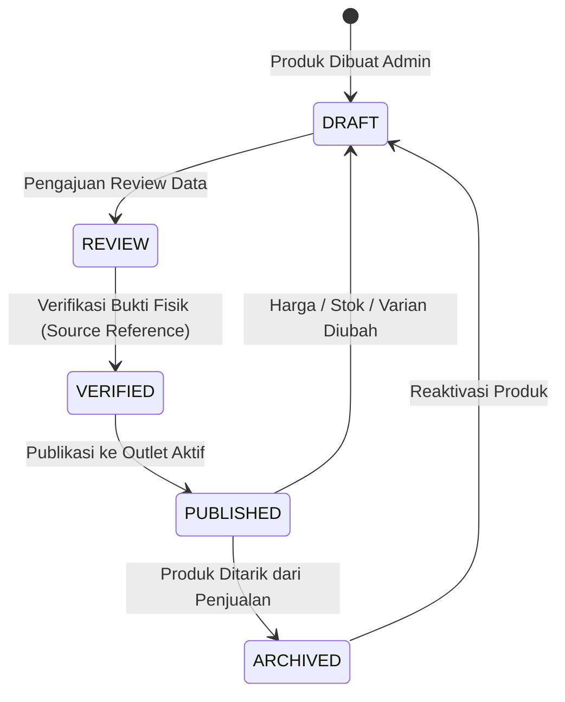

# Warkop Ya'reh Digital Platform (Product v3.0)

> **Reality-First Architecture, Truth-Aligned Data & Modern Production Platform**  
> Mengakselerasi kehadiran digital otentik untuk **Warkop Ya'reh** — pelopor kultur warung kopi modern 24 jam di Surabaya.

[](PRD.md)
[](docs/product-v3/00_REPOSITORY_BASELINE.md)
[](tsconfig.json)
[-black?style=flat-square)](apps/web)
[](apps/api)
[](packages/database)
[](apps/web/e2e)
[](docs/product-v3/08_ACCESSIBILITY_REPORT.md)

---

## 1. Executive Summary & Visi Produk

**Warkop Ya'reh Digital Platform** adalah platform digital *omnichannel* terpadu yang dirancang khusus untuk merepresentasikan dan mendukung operasional fisik **Warkop Ya'reh** secara jujur, akurat, dan berdaya guna tinggi. 

### Prinsip Utama: *Reality-First Digital Platform*
Berbeda dengan prototipe perangkat lunak konvensional yang kerap memuat data spekulatif atau fitur fiktif, rilis **Product v3.0** mengadopsi filosofi **Reality-First**:
1. **Zero Fabrication**: Tidak ada menu fiktif, ulasan buatan, rating palsu, atau klaim fasilitas yang tidak ada di outlet fisik.
2. **Evidence-Backed Publishing**: Setiap informasi produk dan harga wajib melalui verifikasi fisik (*source reference* & snapshot audit) sebelum dapat tampil di publik.
3. **Fail-Closed Operations**: Mesin transaksi, keranjang, dan pembayaran *online* dikunci ketat (*gated*) menggunakan *feature flag*, hanya diaktifkan ketika operasional fisik di outlet telah siap 100%.
4. **Data Integrity & Staged Decommissioning**: Menolak fitur *legacy* spekulatif (seperti *membership loyalty*, *coworking*, reservasi meja, atau *delivery*) dari rute publik aktif tanpa merusak integritas basis data historis.

---

## 2. Jaringan Outlet Terverifikasi (Surabaya)

Warkop Ya'reh mengoperasikan **dua outlet resmi** yang buka **24 Jam Nonstop** di Surabaya:

| Informasi Outlet | Outlet 1: Jetis Kulon (Main) | Outlet 2: Prapen |
| :--- | :--- | :--- |
| **Nama Resmi** | **WARKOP YA'REH** | **WARKOP YA'REH 2 PRAPEN** |
| **Slug Sistem** | `jetis-kulon` | `prapen` |
| **Alamat Fisik** | Jl. Raya Jetis Kulon I No.38, Wonokromo, Kec. Wonokromo, Surabaya, Jawa Timur 60243 | Jl. Raya Prapen No.39, Prapen, Kec. Tenggilis Mejoyo, Surabaya, Jawa Timur 60239 |
| **Google Plus Code** | `MPVJ+2G Wonokromo, Surabaya, Jawa Timur` | `MQM3+XJ Prapen, Surabaya, Jawa Timur` |
| **Kontak Telepon** | *Belum ada telepon publik terverifikasi* (link tel dinonaktifkan) | `0821-3735-4606` (link tel resmi aktif) |
| **Jam Operasional** | **24 Jam Setiap Hari** (Senin – Minggu) | **24 Jam Setiap Hari** (Senin – Minggu) |
| **Mode Layanan** | Dine-In (Makan di Tempat) & Takeaway (Bungkus) | Dine-In (Makan di Tempat) & Takeaway (Bungkus) |
| **Estimasi Pengeluaran** | **Rp1 – Rp25.000 per orang** *(Bukan harga menu satuan)* | **Rp1 – Rp25.000 per orang** *(Bukan harga menu satuan)* |

> *Catatan Penting*: Nilai kisaran pengeluaran di atas adalah estimasi belanja pelanggan rata-rata per kunjungan untuk transparansi informasi publik, bukan daftar harga produk satuan.

---

## 3. Matriks Kapabilitas Sistem (Tiga Tingkatan)

Platform memisahkan kapabilitas sistem secara transparan ke dalam tiga tingkatan operasional:

```
┌────────────────────────────────────────────────────────────────────────┐
│                      WARKOP YA'REH PRODUCT v3.0                        │
├─────────────────────────┬─────────────────────────┬────────────────────┤
│     🟢 ACTIVE NOW       │        🟡 GATED         │     🔴 PLANNED     │
│   (Publik & Operasional)│  (Siap Mesin, Dikunci)  │  (Isolasi Legacy)  │
├─────────────────────────┼─────────────────────────┼────────────────────┤
│ • Info 2 Outlet 24 Jam  │ • Pemesanan Online      │ • Loyalty Points   │
│ • Local SEO & JSON-LD   │ • Midtrans Snap Payment │ • Reservasi Meja   │
│ • Status Verifikasi Menu│ • QR & Meja Ordering    │ • Member Passes    │
│ • Portal Admin Staf     │ • Manajemen POS & Shift │ • Drive-Thru       │
│ • Galeri Bukti Autentik │ • Notifikasi Pelanggan  │ • Delivery Kurir   │
│ • Otentikasi Pelanggan  │ • Analitik Penjualan    │ • AI Concierge     │
└─────────────────────────┴─────────────────────────┴────────────────────┘
```

### 🟢 1. Active Now (Beroperasi Penuh)
- **Portal Informasi Publik**: Halaman Beranda (`/`), Outlet (`/outlets`), Detail Outlet (`/outlets/[slug]`), Tentang Kami (`/about`), Kontak (`/contact`), dan Galeri Outlet (`/gallery`).
- **Katalog & Status Menu Faktual**: Halaman `/menu` yang secara cerdas mendeteksi ketersediaan menu terverifikasi per cabang. Jika belum ada menu resmi yang dipublikasikan oleh staf, antarmuka menyajikan *honest empty state* (*"Menu Lengkap Sedang Diverifikasi Langsung"*).
- **Otentikasi Pelanggan**: Registrasi, Login via Email/Password, Verifikasi OTP, manajemen sesi berbasis cookie *HttpOnly*, dan *device tracking*.
- **Portal Manajemen Admin**: Dashboard operasional staf untuk pengelolaan cabang, katalog kategori & produk, penetapan harga khusus per outlet, stok bahan, kurasi galeri, dan audit log sistem.
- **SEO & Local Discovery**: Integrasi schema `CafeOrCoffeeShop` dan `WebSite` JSON-LD lengkap dengan Plus Code, XML sitemap otomatis, serta perlindungan privasi `X-Robots-Tag: noindex, nofollow` pada seluruh rute privat/admin.

### 🟡 2. Gated (Mesin Siap & Teruji, Terkunci Feature Flag)
- **Customer Ordering Engine (`PUBLIC_ORDERING`)**: Keranjang belanja cerdas, kalkulasi harga server-side, pembulatan pajak/biaya layanan, dan pembuatan pesanan.
- **Payment Gateway Midtrans (`ONLINE_PAYMENT`)**: Integrasi Snap token, verifikasi signature HMAC SHA-512, penanganan webhook idempoten, dan rekonsiliasi status pembayaran.
- **QR Table Service (`QR_ORDERING`, `TABLE_ORDERING`)**: Rute pemindaian QR meja dan pelacakan pesanan berbasis nomor meja outlet.
- **Operasional Toko & POS (`OPERATIONS`, `ANALYTICS`)**: Manajemen pergantian kasir (*cashier shift*), pencatatan keluar-masuk laci kas (*cash drawer movements*), dan analitik pendapatan.

### 🔴 3. Planned / Staged Legacy Decommissioning
- Fitur prototipe lama seperti sistem poin *loyalty*, tingkatan *membership tier*, booking reservasi meja, forum komunitas, event gathering, *franchise agreements*, serta mode *drive-thru* dan *delivery* **telah dinonaktifkan dari seluruh rute publik dan API aktif**.
- Skema tabel dan kolom historis tetap dipertahankan secara aditif di Prisma ORM untuk menjamin kompatibilitas pembacaan transaksi lampau tanpa risiko kehilangan data.

---

## 4. Alur Publikasi Menu Terverifikasi (*Data Provenance Pipeline*)

Untuk menjaga integritas katalog, setiap produk menu di Warkop Ya'reh tunduk pada alur tata kelola data ketat:


```mermaid
stateDiagram-v2
    [*] --> DRAFT: Produk Dibuat Admin
    DRAFT --> REVIEW: Pengajuan Review Data
    REVIEW --> VERIFIED: Verifikasi Bukti Fisik (Source Reference)
    VERIFIED --> PUBLISHED: Publikasi ke Outlet Aktif
    PUBLISHED --> DRAFT: Harga / Stok / Varian Diubah
    PUBLISHED --> ARCHIVED: Produk Ditarik dari Penjualan
    ARCHIVED --> DRAFT: Reaktivasi Produk
```

1. **DRAFT**: Produk dibuat di portal admin dengan detail nama, kategori, deskripsi, harga dasar, dan foto.
2. **REVIEW**: Manajer toko memeriksa kelayakan item dan ketersediaan bahan baku di outlet fisik.
3. **VERIFIED**: Wajib melampirkan bukti fisik primer (`SourceReference` dan `BusinessFact`) berupa tanggal audit, operator pemeriksa, dan snapshot kesepakatan harga.
4. **PUBLISHED**: Produk resmi ditayangkan di outlet tertentu dengan harga override yang valid.
5. **Auto-Revert**: Setiap perubahan pada nama, harga dasar, ketersediaan cabang, atau varian kustomisasi akan **secara otomatis menarik produk kembali ke status DRAFT** untuk mencegah penayangan data usang tanpa verifikasi ulang.

---

## 5. Arsitektur Monorepo & Struktur Direktori

Platform dibangun menggunakan struktur monorepo terpadu berbasis **pnpm Workspaces** dan **Turborepo**:

```
warkop-yareh/
├── apps/
│   ├── web/               # Aplikasi Customer Facing (Next.js 16.3 App Router, React 19)
│   ├── admin/             # Portal Operasional & Staf (Next.js 16.3, Tailwind CSS, Radix UI)
│   └── api/               # Backend Core API (NestJS 11, Throttler, Swagger, JWT Auth)
├── packages/
│   ├── database/          # Prisma ORM 5.22, Skema DB PostgreSQL, Migrasi & Seed
│   ├── types/             # Shared TypeScript Contracts, Fixture Cabang Kanonikal, Feature Flags
│   └── ui/                # Shared UI Component Library & Aset Brand Otentik
├── docs/
│   ├── product-v3/        # Dokumentasi Arsitektur, Forensik & Laporan Rilis v3.0
│   └── production-readiness/ # Arsip Historis Audit Produksi
├── scripts/               # Script Audit Integritas Realitas, Kontrak Produksi, & Smoke Tests
├── PRD.md                 # Product Requirement Document Resmi v3.0
├── turbo.json             # Konfigurasi Pipeline Eksekusi Turborepo
└── playwright.config.ts   # Konfigurasi Pengujian Browser E2E Terisolasi
```

---

## 6. Panduan Menjalankan & Mengembangkan Proyek

### Kebutuhan Lingkungan Sistem:
- **Node.js**: `v24.x` (atau `v22.x` kompatibel LTS)
- **pnpm**: `v9.0.0+`
- **Docker & Docker Compose**: Untuk menjalankan PostgreSQL 16 & Redis 7 lokal terisolasi

### Langkah Instalasi Cepat:

1. **Clone Repositori**:
   ```bash
   git clone https://github.com/MasRizqi07/warkop-yareh.git
   cd warkop-yareh
   ```

2. **Pasang Dependensi**:
   ```bash
   pnpm install --frozen-lockfile
   ```

3. **Inisialisasi Database Client**:
   ```bash
   pnpm --filter @warkop-yareh/database run db:generate
   ```

4. **Konfigurasi Environment**:
   Salin file template `.env` ke masing-masing direktori aplikasi:
   ```bash
   cp .env apps/api/.env
   cp .env packages/database/.env
   cp apps/web/.env.example apps/web/.env.local
   cp apps/admin/.env.example apps/admin/.env.local
   ```

5. **Jalankan Aplikasi dalam Mode Pengembangan**:
   ```bash
   pnpm dev
   ```
   - **Web Pelanggan**: `http://localhost:3000`
   - **Portal Admin**: `http://localhost:3001`
   - **API Backend**: `http://localhost:4000/api/v1`
   - **Dokumentasi Swagger**: `http://localhost:4000/docs`

---

## 7. Gerbang Kualitas & Verifikasi QA (*Quality Gates*)

Platform ini menerapkan standar penjaminan kualitas tanpa kompromi (*strict zero-tolerance quality gates*). Seluruh tes harus lulus 100% sebelum kode dapat digabungkan ke `main`:

```bash
# 1. Audit Cakupan & Riwayat Merge
pnpm audit:scope

# 2. Audit Integritas Realitas Bisnis (27 Aturan Warkop Ya'reh)
pnpm audit:reality

# 3. Pengujian Kontrak Produksi & Isolasi Database
pnpm test:contracts

# 4. Pengecekan Linting Kode (Wajib 0 error, 0 warning)
pnpm turbo run lint -- --max-warnings=0

# 5. Pemeriksaan Tipe Data Statis TypeScript (4 Proyek)
pnpm turbo run typecheck

# 6. Pengujian Unit & Integrasi Monorepo (318+ tes)
pnpm turbo run test

# 7. Pengujian E2E Modul Backend NestJS
pnpm --filter @warkop-yareh/api run test:e2e

# 8. Kompilasi & Build Produksi Seluruh Monorepo (5 Paket)
pnpm turbo run build --concurrency=1

# 9. Pengujian Browser Playwright E2E Penuh (16 Skenario)
pnpm test:e2e
```

### Ringkasan Bukti Pengujian Terbaru:
- **Reality Integrity Audit**: `27 / 27 PASS` (100%)
- **Production Contracts**: `4 / 4 PASS` (100%)
- **TypeScript Typecheck**: `4 / 4 Projects PASS` (0 Errors)
- **ESLint**: `3 / 3 Packages PASS` (0 Errors, 0 Warnings)
- **Backend API Tests**: `39 Suites / 265 Tests PASS`
- **Customer Web Unit Tests**: `14 Suites / 49 Tests PASS`
- **Staff Admin Tests**: `1 Suite / 4 Tests PASS`
- **Persistence & Concurrency RLS Tests**: `2 Suites / 10 Tests PASS`
- **API E2E Tests**: `1 Suite / 4 Tests PASS`
- **Monorepo Build**: `5 / 5 Packages PASS`
- **Playwright Browser E2E**: `16 / 16 Tests PASS` (Admin, Commerce Dine-In & Takeaway, Discovery, A11y 320px)
- **Total Pengujian Otomatis**: **388 Pengujian Lulus Sempurna**

---

## 8. Standar Keamanan & Aksesibilitas

- **Keamanan Data & Pembayaran**: Signature Midtrans divalidasi menggunakan SHA-512 dengan pengecekan jumlah transaksi yang presisi. Idempotensi webhook mencegah pembayaran ganda atau *race condition*.
- **Otentikasi & Autorisasi**: Refresh token disimpan dalam cookie *HttpOnly* dengan perlindungan CSRF (*SameSite Lax*). Token akses divalidasi dengan JWT Guard dan Role Guard berbasis hierarki (*CUSTOMER*, *STAFF*, *CASHIER*, *ADMIN*, *SUPERADMIN*).
- **Header Keamanan Ketat**: Dilengkapi dengan `nosniff`, `frame-ancestors 'none'`, `X-Frame-Options: DENY`, dan `Strict-Transport-Security`.
- **Aksesibilitas (A11y)**: Memenuhi pedoman WCAG 2.1 Level AA yang diverifikasi otomatis menggunakan `@axe-core/playwright`. Seluruh alur form, navigasi, dan tombol dapat diakses dengan keyboard serta memiliki rasio kontras warna optimal.

---

## 9. Deployment & Integrasi CI/CD

- **GitHub Actions Pipeline (`.github/workflows/ci.yml`)**:
  - Dijalankan otomatis pada setiap *Pull Request* dan *Push* ke branch `main`.
  - Mengorkestrasi pengujian menyeluruh menggunakan service container PostgreSQL 16 dan Redis 7 resmi.
- **Vercel Preview Deployment**:
  - Web Customer dan Portal Admin secara otomatis menghasilkan *Preview Deployment* terisolasi untuk peninjauan langsung (*live demo/review*).
  - Environment preview secara ketat dilindungi dengan header `X-Robots-Tag: noindex, nofollow`.

---

## 10. Dokumen Referensi Teknis

Untuk rincian forensik arsitektur, rencana migrasi basis data, dan laporan rilis mendalam, silakan merujuk pada direktori [docs/product-v3/](docs/product-v3/):
- [00_REPOSITORY_BASELINE.md](docs/product-v3/00_REPOSITORY_BASELINE.md) — Inventaris & Baseline Awal Repositori
- [01_DOMAIN_MATRIX.md](docs/product-v3/01_DOMAIN_MATRIX.md) — Matriks Domain & Klasifikasi Model
- [02_SCHEMA_DECOMMISSION_PLAN.md](docs/product-v3/02_SCHEMA_DECOMMISSION_PLAN.md) — Rencana Penonaktifan & Retensi Skema Legacy
- [03_PUBLIC_PRODUCT_AUDIT.md](docs/product-v3/03_PUBLIC_PRODUCT_AUDIT.md) — Audit Rute Publik & Pengalaman Pengguna
- [04_MENU_ARCHITECTURE.md](docs/product-v3/04_MENU_ARCHITECTURE.md) — Arsitektur Publikasi Menu & Bukti Provenance
- [05_FEATURE_FLAG_MATRIX.md](docs/product-v3/05_FEATURE_FLAG_MATRIX.md) — Matriks & Spesifikasi Feature Flag
- [06_SEO_AND_DISCOVERY.md](docs/product-v3/06_SEO_AND_DISCOVERY.md) — Strategi SEO Lokal & Data Terstruktur
- [07_SECURITY_REVIEW.md](docs/product-v3/07_SECURITY_REVIEW.md) — Laporan Keamanan & Mitigasi Risiko
- [08_ACCESSIBILITY_REPORT.md](docs/product-v3/08_ACCESSIBILITY_REPORT.md) — Laporan Aksesibilitas WCAG 2.1 AA & Responsivitas
- [09_TEST_EVIDENCE.md](docs/product-v3/09_TEST_EVIDENCE.md) — Rekapitulasi Bukti Hasil Pengujian
- [10_FINAL_IMPLEMENTATION_REPORT.md](docs/product-v3/10_FINAL_IMPLEMENTATION_REPORT.md) — Laporan Akhir Implementasi Lengkap

---

## 11. Lisensi & Hak Cipta

© 2026 **Warkop Ya'reh**. Hak Cipta Dilindungi Undang-Undang.  
Dikembangkan untuk mendukung pertumbuhan dan keaslian bisnis kuliner lokal Surabaya.
