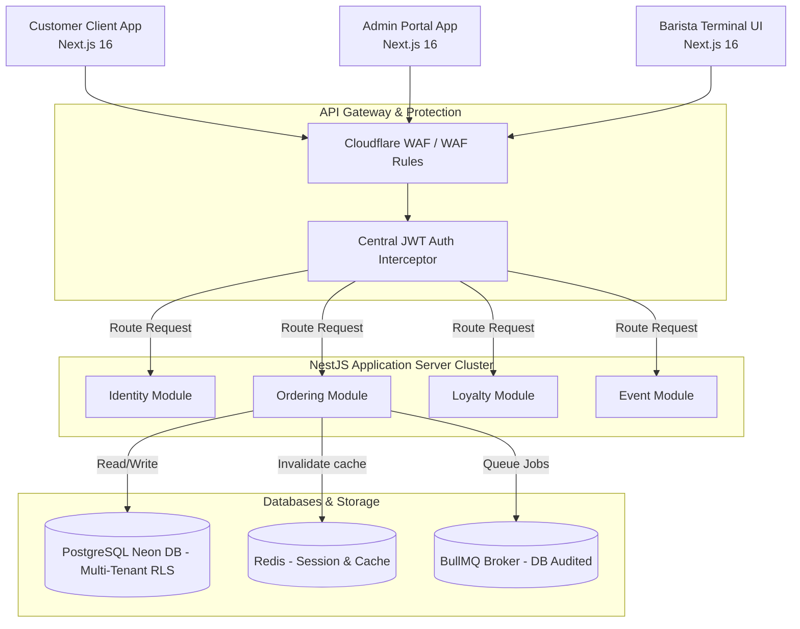

# 🏛️ Enterprise Architecture Blueprint (Audited & Verified)

## Project: Warkop Ya'reh Digital Platform

This document describes the audited enterprise architecture of the **Warkop Ya'reh** platform, structured to support 100,000+ active users, 50+ branches, regional franchise divisions, and AI operations over a 5–10 year business timeline.

---

## 1. System Context & Container Flow

Warkop Ya'reh utilizes a **Modular Monolith First** pattern with clear domain-boundary separation, preparing it to easily split into microservices as scaling demands.



---

## 2. Bounded Contexts & DDD Aggregate Models

### 2.1 Domain Context Separation

To prevent the system from degenerating into a "Big Ball of Mud", Bounded Contexts are isolated using NestJS module separation and independent domain entities.

### 2.2 Product Pricing Snapshotting (Audit Resolution)

To prevent changes in the product catalog from retroactively altering historical order receipts, the `Ordering` context snapshots catalog data during order checkouts.

```prisma
model OrderItem {
  id             String  @id @default(cuid())
  orderId        String
  order          Order   @relation(fields: [orderId], references: [id], onDelete: Cascade)
  productId      String
  quantity       Int

  // Audited Price Snapshot Fields
  snapshotName   String  // Static name at checkout
  snapshotPrice  Int     // Static unit price at checkout
  snapshotTax    Int     // Static tax rate at checkout
  customizations Json?   // Stored configuration options snapshot
}
```

---

## 3. Multi-Tenant Database Architecture & RLS

We employ a **Shared Database, Shared Schema with Row-Level Security (RLS)** model in Neon PostgreSQL.

### 3.1 Tenant Isolation Engine (C-01 / H-02 Audit Fix)

To prevent SQL injection attacks in the multi-tenant interceptor, request headers and user identifiers are strictly validated using a UUID regular expression. Queries are parameterized using Prisma tagged template literals (`$executeRaw`):

```typescript
import {
  Injectable,
  NestInterceptor,
  ExecutionContext,
  CallHandler,
  ForbiddenException,
} from "@nestjs/common";
import { Observable } from "rxjs";
import { PrismaService } from "../database/prisma.service";

@Injectable()
export class TenantIsolationInterceptor implements NestInterceptor {
  constructor(private readonly prisma: PrismaService) {}

  async intercept(
    context: ExecutionContext,
    next: CallHandler,
  ): Promise<Observable<any>> {
    const req = context.switchToHttp().getRequest();
    const userId = req.user?.id;
    const branchId = req.headers["x-branch-id"];

    // Strict format validation to block SQL injection vectors
    const uuidRegex =
      /^[0-9a-f]{8}-[0-9a-f]{4}-[0-9a-f]{4}-[0-9a-f]{4}-[0-9a-f]{12}$/i;
    if (userId && !uuidRegex.test(userId))
      throw new ForbiddenException("Invalid User context ID format.");
    if (branchId && !uuidRegex.test(branchId))
      throw new ForbiddenException("Invalid Tenant context ID format.");

    // Parameterized queries (using safe template tags) executing locally within the transaction boundary
    await this.prisma
      .$executeRaw`SET LOCAL app.current_user_id = ${userId || ""}`;
    await this.prisma
      .$executeRaw`SET LOCAL app.current_branch_id = ${branchId || ""}`;

    return next.handle();
  }
}
```

### 3.2 Current State vs Planned State (H-02 Audit Fix)

- **Current State (Phases 1-3)**: The RLS schema rules are designed, declared, and validated in test databases using test containers. However, to simplify initial developer setup and local seeding, RLS is disabled by default on local development Docker databases and active on deployment targets.
- **Planned State (Phase 4)**: RLS database triggers and schema isolation restrictions are forced globally in the production database clusters during the launch of the Franchise Portal.

---

## 4. Asynchronous Event-Driven Design & Outbox Pattern

To prevent distributed transactional failures, side effects (such as points calculation or check-in emails) execute asynchronously using the **Transactional Outbox Pattern** backed by BullMQ.

### 4.1 Outbox Relayer Mechanism (H-06 Audit Fix)

We implement a **Polling Relayer** to fetch and publish events, avoiding the operational complexity of Kafka/Debezium on Neon.

- **Database Schema**:
  ```prisma
  model OutboxEvent {
    id             String    @id @default(cuid())
    aggregateType  String    // e.g. "Order"
    aggregateId    String    // e.g. "ord_123"
    eventType      String    // e.g. "OrderPaid"
    payload        Json      // Event payload
    createdAt      DateTime  @default(now())
    processedAt    DateTime?

    @@index([processedAt, createdAt])
    @@map("outbox_events")
  }
  ```
- **Polling Loop**: A NestJS Cron job queries the database for unprocessed events every **5 seconds**, publishes them to the BullMQ broker, and marks them as processed within a localized database transaction.
- **Idempotency Strategy**: The consumer records processed `eventId` values in Redis with a 24-hour TTL to prevent duplicate execution of re-processed events.
- **Dead-Letter Queue (DLQ)**: Failed event jobs are retried up to **5 times** using an exponential backoff formula, after which they are moved to a dead-letter queue (`dlq-failed-events`) for auditing.

---

## 5. Security & Authentication Controls

### 5.1 Refresh Token Rotation Flow (H-04 Audit Fix)

To enforce secure session revocation:

1. **Cookie Storage**: The JWT Refresh Token is stored in a secure `HttpOnly`, `Secure`, `SameSite=Strict` cookie named `__Host-next-auth.refresh-token`.
2. **Redis Registry**: On login, a hash of the refresh token is stored in Redis (`refresh_token:hash`) with a 7-day TTL matching the token's lifetime.
3. **Atomic Rotation**: When a token refresh request is made:
   - The NestJS controller verifies the token hash exists in Redis.
   - The old hash is atomically deleted from Redis.
   - If reuse is detected (i.e. the hash is missing), the API invalidates all active sessions for that user.
   - A new refresh token is issued and its hash is saved to Redis.

### 5.2 CORS Configuration Strategy (H-05 Audit Fix)

Because the frontend portal (Vercel) and backend API (AWS ECS Fargate) run on different domains, the following CORS strategy is enforced:

- **Allowed Origins**: Scoped strictly to specific domains (e.g. `https://warkop-yareh.com` and `https://admin.warkop-yareh.com`).
- **Credentials Support**: `Access-Control-Allow-Credentials: true` is enabled to support HTTPOnly session cookies.
- **Allowed Headers**: Restricted to `Content-Type`, `Authorization`, and `x-branch-id`.
- **Max Age**: Preflight responses are cached for **86400 seconds** (24 hours) at the browser level to reduce preflight requests.

---

## 6. API & Communication Contracts (M-02 Audit Fix)

- **REST API**: We use REST for all customer and admin transactions. Next.js Server Actions act as backend-for-frontend (BFF) wrappers, proxying requests directly to the REST API.
- **OpenAPI 3.1 Specification**: The NestJS API uses `@nestjs/swagger` to auto-generate OpenAPI 3.1 specifications. Clients fetch endpoints from `/api/docs/swagger-json` to compile type-safe SDK interfaces.
- **Granular RBAC Matrix**:
  - `CUSTOMER`: Reads menus, reserves tables, and views personal profiles and orders.
  - `STAFF`: Fulfills local orders, scans ticket check-ins, and tracks branch inventory.
  - `MANAGER`: Overrides branch pricing configurations and manages local staff roles.
  - `ADMIN`: Configures national branch systems and audits franchise billing invoices.
  - `SUPERADMIN`: Full system controls, including database schema migrations and licensing configurations.
- **Audit Trails**: All database modifications write records directly to the `audit_logs` table using Postgres database triggers. The application layer cannot modify or delete audit logs.
