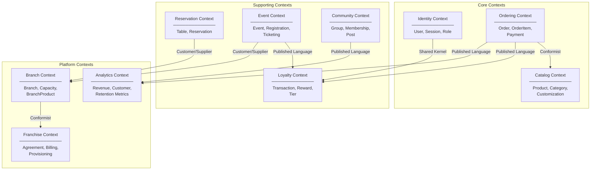

# 🧩 Domain Architecture — Warkop Ya'reh Digital Ecosystem

## 1. Bounded Context Map

---

## 2. Aggregates, Entities & Value Objects

### 2.1 Identity Context

| Type | Name | Description |
|:-----|:-----|:------------|
| **Aggregate Root** | `User` | Central identity aggregate |
| Entity | `Session` | Active login sessions for refresh token rotation |
| Value Object | `Email` | Validated email format |
| Value Object | `Phone` | Indonesian phone format (+62) |
| Value Object | `MembershipTier` | BRONZE / SILVER / GOLD / PLATINUM |
| Value Object | `ReferralCode` | Unique shareable referral identifier |
| Domain Event | `UserRegistered` | New user created |
| Domain Event | `UserProfileUpdated` | Profile data changed |
| Domain Event | `TierUpgraded` | Membership tier promoted |

### 2.2 Catalog Context

| Type | Name | Description |
|:-----|:-----|:------------|
| **Aggregate Root** | `Product` | Menu item aggregate |
| Entity | `Category` | Product grouping |
| Entity | `ProductCustomization` | Customization options (sweetness, ice, etc.) |
| Entity | `BranchProduct` | Branch-specific availability/price override |
| Value Object | `Money` | Price with currency (IDR) |
| Value Object | `Slug` | URL-safe identifier |
| Domain Event | `ProductCreated` | New menu item added |
| Domain Event | `ProductUpdated` | Product details changed |
| Domain Event | `ProductAvailabilityChanged` | Branch stock toggled |

### 2.3 Ordering Context

| Type | Name | Description |
|:-----|:-----|:------------|
| **Aggregate Root** | `Order` | Order lifecycle aggregate |
| Entity | `OrderItem` | Line item with price snapshot |
| Value Object | `OrderStatus` | PENDING → CONFIRMED → PREPARING → READY → COMPLETED / CANCELLED |
| Value Object | `PaymentStatus` | UNPAID / PAID / REFUNDED / FAILED |
| Value Object | `OrderNumber` | Human-readable order number (e.g., WY-20260711-0042) |
| Value Object | `Money` | Immutable monetary value |
| Domain Event | `OrderCreated` | New order placed |
| Domain Event | `OrderPaid` | Payment confirmed |
| Domain Event | `OrderStatusChanged` | Status transition |
| Domain Event | `OrderCancelled` | Order voided |

### 2.4 Reservation Context

| Type | Name | Description |
|:-----|:-----|:------------|
| **Aggregate Root** | `Reservation` | Booking lifecycle aggregate |
| Entity | `Table` | Physical seating unit |
| Value Object | `TimeSlot` | Start/end time pair |
| Value Object | `ReservationStatus` | PENDING / CONFIRMED / CANCELLED / COMPLETED / NO_SHOW |
| Value Object | `TableType` | INDOOR / OUTDOOR / VIP / MEETING_ROOM |
| Domain Event | `ReservationCreated` | New booking made |
| Domain Event | `ReservationConfirmed` | Booking approved |
| Domain Event | `ReservationCancelled` | Booking cancelled |

### 2.5 Event Context

| Type | Name | Description |
|:-----|:-----|:------------|
| **Aggregate Root** | `Event` | Event lifecycle aggregate |
| Entity | `EventRegistration` | Attendee enrollment |
| Value Object | `EventStatus` | UPCOMING / ONGOING / COMPLETED / CANCELLED |
| Value Object | `EventCategory` | WORKSHOP / MUSIC / COMMUNITY / BUSINESS / ART / TECH / FOOD |
| Value Object | `TicketCode` | Unique encrypted QR ticket identifier |
| Domain Event | `EventCreated` | New event published |
| Domain Event | `EventJoined` | Attendee registered |
| Domain Event | `AttendanceMarked` | QR check-in scanned |

### 2.6 Community Context

| Type | Name | Description |
|:-----|:-----|:------------|
| **Aggregate Root** | `CommunityGroup` | Guild/club aggregate |
| Entity | `CommunityMembership` | User-group relationship |
| Entity | `CommunityPost` | User content within a group |
| Value Object | `CommunityMemberRole` | MEMBER / MODERATOR / ADMIN |
| Domain Event | `GroupCreated` | New guild established |
| Domain Event | `MemberJoined` | User joined a group |
| Domain Event | `PostCreated` | New discussion posted |

### 2.7 Loyalty Context

| Type | Name | Description |
|:-----|:-----|:------------|
| **Aggregate Root** | `LoyaltyWallet` | Points balance aggregate (maps to User) |
| Entity | `LoyaltyTransaction` | Individual points movement |
| Entity | `Reward` | Redeemable reward catalog item |
| Value Object | `LoyaltyType` | EARNED / REDEEMED / EXPIRED / BONUS / REFERRAL |
| Value Object | `Points` | Non-negative integer points value |
| Domain Event | `PointsAwarded` | Points credited |
| Domain Event | `PointsRedeemed` | Points spent on reward |
| Domain Event | `PointsExpired` | Points TTL expired |
| Domain Event | `RewardRedeemed` | Reward claimed |

### 2.8 Analytics Context

| Type | Name | Description |
|:-----|:-----|:------------|
| **Aggregate Root** | `AnalyticsSnapshot` | Periodic metrics aggregate |
| Value Object | `DateRange` | Analysis time window |
| Value Object | `MetricType` | REVENUE / ORDERS / CUSTOMERS / RETENTION / CONVERSION |

### 2.9 Branch Context

| Type | Name | Description |
|:-----|:-----|:------------|
| **Aggregate Root** | `Branch` | Physical location aggregate |
| Value Object | `GeoCoordinates` | Latitude/longitude pair |
| Value Object | `OperatingHours` | Weekday/weekend schedule |
| Domain Event | `BranchCreated` | New location added |
| Domain Event | `BranchUpdated` | Location details modified |

### 2.10 Franchise Context (Phase 4)

| Type | Name | Description |
|:-----|:-----|:------------|
| **Aggregate Root** | `FranchiseAgreement` | Licensing contract aggregate |
| Entity | `FranchiseBilling` | Monthly billing records |
| Value Object | `AgreementStatus` | ACTIVE / SUSPENDED / TERMINATED |
| Domain Event | `FranchiseProvisioned` | New franchise branch activated |
| Domain Event | `BillingGenerated` | Monthly invoice created |

---

## 3. Domain Events Catalog (Complete)

| # | Event Name | Producer | Consumers | Payload |
|:--|:-----------|:---------|:----------|:--------|
| 1 | `UserRegistered` | Identity | Loyalty, Community, Notification | userId, email, name |
| 2 | `UserProfileUpdated` | Identity | Analytics | userId, changedFields |
| 3 | `TierUpgraded` | Loyalty | Identity, Notification | userId, oldTier, newTier |
| 4 | `OrderCreated` | Ordering | Analytics, Notification | orderId, userId, branchId, total |
| 5 | `OrderPaid` | Ordering | Loyalty, Analytics, Notification | orderId, userId, total |
| 6 | `OrderStatusChanged` | Ordering | Notification | orderId, oldStatus, newStatus |
| 7 | `OrderCancelled` | Ordering | Loyalty (reverse points), Analytics | orderId, userId |
| 8 | `ReservationCreated` | Reservation | Branch, Notification | reservationId, userId, branchId |
| 9 | `ReservationConfirmed` | Reservation | Notification | reservationId, userId |
| 10 | `ReservationCancelled` | Reservation | Branch (release capacity) | reservationId |
| 11 | `EventCreated` | Event | Notification (subscribers) | eventId, branchId, title |
| 12 | `EventJoined` | Event | Loyalty, Analytics | eventId, userId, ticketCode |
| 13 | `AttendanceMarked` | Event | Loyalty (bonus points) | eventId, userId |
| 14 | `PointsAwarded` | Loyalty | Notification | userId, points, reason |
| 15 | `PointsRedeemed` | Loyalty | Notification | userId, points, rewardId |
| 16 | `PointsExpired` | Loyalty | Notification | userId, points |
| 17 | `RewardRedeemed` | Loyalty | Notification, Analytics | userId, rewardId |
| 18 | `PostCreated` | Community | Analytics | postId, groupId, authorId |
| 19 | `MemberJoined` | Community | Analytics, Notification | userId, groupId |
| 20 | `BranchCreated` | Branch | Franchise | branchId, name, city |
| 21 | `ProductAvailabilityChanged` | Catalog | Notification (subscribers) | productId, branchId, available |
| 22 | `FranchiseProvisioned` | Franchise | Branch, Identity | franchiseId, branchIds |

---

## 4. Context Mapping Relationships

| Upstream | Downstream | Relationship Type | Description |
|:---------|:-----------|:------------------|:------------|
| Identity | All contexts | **Shared Kernel** | User identity is shared across all domains |
| Catalog | Ordering | **Conformist** | Ordering snapshots catalog data at checkout time |
| Ordering | Loyalty | **Published Language** | OrderPaid event triggers points calculation |
| Ordering | Analytics | **Published Language** | Order events feed revenue metrics |
| Reservation | Branch | **Customer/Supplier** | Branch supplies table capacity data |
| Event | Branch | **Customer/Supplier** | Branch supplies venue information |
| Event | Loyalty | **Published Language** | EventJoined triggers attendance points |
| Community | Analytics | **Published Language** | Engagement metrics feed analytics |
| Branch | Franchise | **Conformist** | Branch data feeds franchise reporting |
