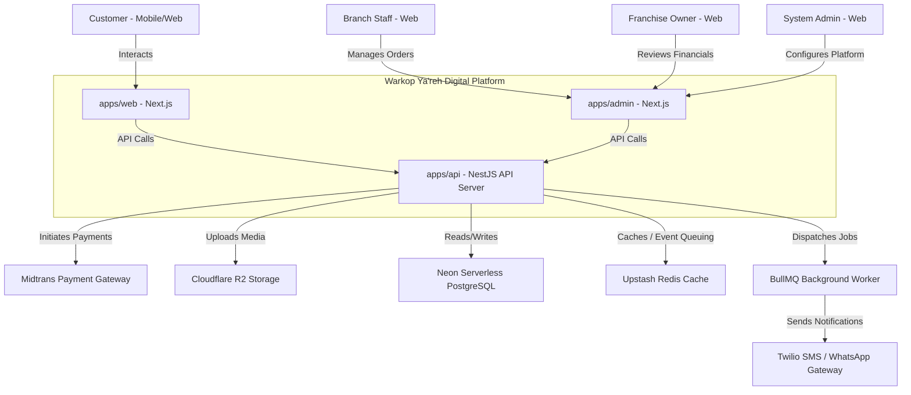
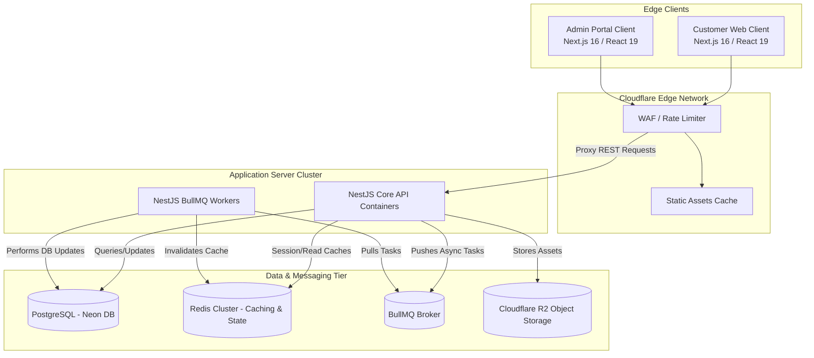
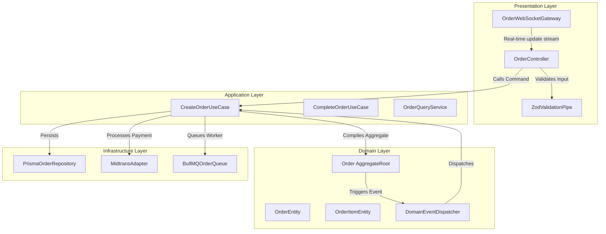
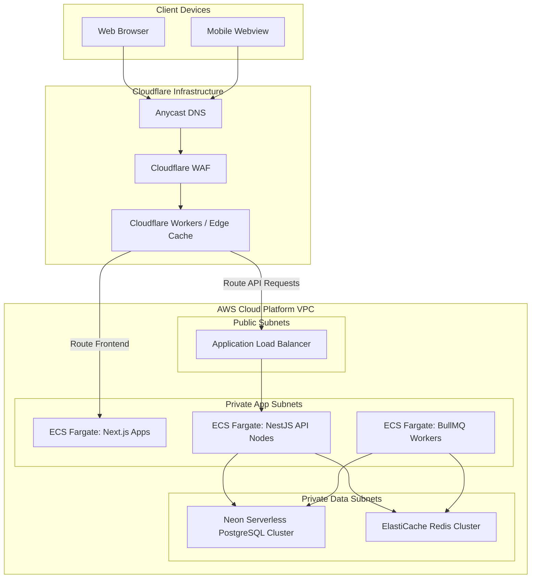

# 📄 Warkop Ya'reh — Enterprise Architecture Blueprint

> **Status:** Target-state blueprint. Source versions and authentication flow are kept aligned, while named cloud services and rollout claims still require deployment evidence.

This document defines the comprehensive enterprise architecture for the **Warkop Ya'reh Digital Ecosystem Platform**. It is designed as a scalable blueprint to support 100,000+ active users, 50+ branches, regional franchise operations, and automated AI operations over the next 5–10 years.

---

## 1. Product Architecture

The Warkop Ya'reh digital platform is not a simple food ordering application. It is a **community-first lifestyle ecosystem** designed to bridge physical retail locations (Warkop) with a high-engagement digital platform.

```
                                  ┌──────────────────────────┐
                                  │   Customer Experience    │
                                  └────────────┬─────────────┘
                                               │ (Transactions)
                                               ▼
┌──────────────────────────┐      ┌──────────────────────────┐      ┌──────────────────────────┐
│   Community Engagement   │ ◄─── │  Loyalty & Points Engine │ ◄─── │   Event Ticketing/Hub    │
└────────────┬─────────────┘      └────────────┬─────────────┘      └────────────┬─────────────┘
             │                                 │                                 │
             └────────────────────────┐        │        ┌────────────────────────┘
                                      ▼        ▼        ▼
                               ┌──────────────────────────┐
                               │   AI & Analytics Core    │
                               └────────────┬─────────────┘
                                            │ (Insights)
                                            ▼
                               ┌──────────────────────────┐
                               │ Franchise / Multi-Branch │
                               └──────────────────────────┘
```

### 1.1 Product Vision

To establish Warkop Ya'reh as the premier community-driven digital coffee brand in Indonesia by leveraging technology to cultivate hyper-local community hubs, automate restaurant logistics, and empower franchise operators with enterprise-grade business intelligence.

### 1.2 Product Strategy (The Flywheel Effect)

- **Phase 1: Acquisition (Customer Experience)**: A seamless digital ordering, checkout, and table-reservation system draws customers in.
- **Phase 2: Retention (Loyalty & Gamification)**: Transactions reward users with loyalty points and unlock status tiers (Bronze, Silver, Gold, Platinum).
- **Phase 3: Activation (Community & Events)**: Customers spend points on local events (developer meetups, music shows) and join branch-specific community groups.
- **Phase 4: Monetization & Expansion (Franchise & BI)**: The platform aggregates user interactions, event registrations, and purchase behaviors into actionable insights to optimize branch inventory and drive franchise expansion.

### 1.3 Product Boundaries & Domains

1. **Identity & Access Context**: Handles registration, OAuth logins, profile metadata, and multi-tier RBAC (`CUSTOMER`, `STAFF`, `MANAGER`, `ADMIN`, `OWNER`).
2. **Catalog Context**: Manages items, categories, ingredients, and custom options (sugar, ice, toppings).
3. **Ordering Context**: Coordinates carts, tax math, discounts, invoice building, and payment gateway coordination.
4. **Reservation Context**: Books tables dynamically, checks capacity slots, and tracks seat availability.
5. **Community Context**: Houses groups, memberships, forums, user postings, and local social leaderboards.
6. **Event Context**: Oversees ticketing, registrations, attendee check-ins (QR-based), and metrics.
7. **Loyalty Context**: Manages points transaction legers, tier benefits, and referral bonuses.
8. **Franchise Context**: Handles licensing, corporate royalty tracking, agreements, and franchise owner analytics.
9. **Branch Context**: Coordinates configurations, layout mapping, staffing, inventory, and location coordinates.
10. **AI Engine Context**: Powers the conversational concierge, menu assistants, and automated recommendation models.

---

## 2. System Architecture

The ecosystem uses a layered component architecture utilizing Next.js at the edge for client applications and NestJS for backend business domains.

### 2.1 System Context Diagram (C4 Level 1)



### 2.2 System Container Diagram (C4 Level 2)



### 2.3 System Component Diagram (C4 Level 3 - Ordering Domain)



### 2.4 Deployment Diagram



---

## 3. Domain Architecture

In alignment with Domain-Driven Design (DDD), Warkop Ya'reh is structured around highly separated Bounded Contexts.

### 3.1 Bounded Context Mapping

```
┌────────────────────────────────────────────────────────────────────────────┐
│                        WARKOP YA'REH BOUNDED CONTEXTS                      │
│                                                                            │
│  ┌───────────────────────┐                  ┌───────────────────────────┐  │
│  │   Identity Context    │◄─────────────────┤     Loyalty Context       │  │
│  └───────────┬───────────┘                  └─────────────▲─────────────┘  │
│              │                                            │                │
│              ▼                                            │                │
│  ┌───────────────────────┐                  ┌─────────────┴─────────────┐  │
│  │   Ordering Context    │◄─────────────────┤     Community Context     │  │
│  └───────────┬───────────┘                  └─────────────▲─────────────┘  │
│              │                                            │                │
│              ▼                                            │                │
│  ┌───────────────────────┐                  ┌─────────────┴─────────────┐  │
│  │    Catalog Context    │◄─────────────────┤       Event Context       │  │
│  └───────────────────────┘                  └───────────────────────────┘  │
│                                                                            │
└────────────────────────────────────────────────────────────────────────────┘
```

### 3.2 Domain Aggregates, Entities, and Value Objects

#### 🛒 Order Aggregate

- **Aggregate Root**: `Order`
- **Internal Entities**: `OrderItem`, `PaymentInfo`, `OrderStatusHistory`
- **Value Objects**:
  - `Money` (composed of `amount: number` and `currency: string`)
  - `OrderNumber` (string structured as `WY-{YYYYMMDD}-{CUID}`)
  - `CustomizationSelection` (attributes: `optionId`, `label`, `priceOverride`)

#### 🏢 Branch Aggregate

- **Aggregate Root**: `Branch`
- **Internal Entities**: `Table`, `OperatingHours`, `BranchInventory`
- **Value Objects**:
  - `GeoCoordinates` (`latitude: Float`, `longitude: Float`)
  - `Address` (`street`, `city`, `province`, `postalCode`)

#### 👤 User Aggregate

- **Aggregate Root**: `User`
- **Internal Entities**: `LoyaltyProfile`, `NotificationPreference`
- **Value Objects**:
  - `EmailAddress` (validated string format)
  - `PhoneNumber` (standardized E.164 phone string)

#### 📅 Event Aggregate

- **Aggregate Root**: `Event`
- **Internal Entities**: `TicketTier`, `Speaker`, `EventRegistration`
- **Value Objects**:
  - `DateTimeInterval` (`startDate`, `endDate`, `timezone`)
  - `TicketCode` (unique secure cryptographic string)

---

## 4. Backend Architecture

The backend NestJS API (`apps/api`) implements a strict Hexagonal (Ports and Adapters) structure to isolate the domain logic from external libraries, ORMs, and transport layers.

### 4.1 NestJS Directory Structures (Modular Domain Layout)

```lisptemplate
apps/api/src/
├── app.module.ts
├── main.ts
└── modules/
    ├── ordering/
    │   ├── ordering.module.ts
    │   ├── domain/                         # Pure business logic (Zero external dependencies)
    │   │   ├── models/
    │   │   │   ├── order.aggregate.ts
    │   │   │   └── order-item.entity.ts
    │   │   ├── value-objects/
    │   │   │   └── money.value-object.ts
    │   │   ├── repositories/
    │   │   │   └── order.repository.interface.ts
    │   │   └── events/
    │   │       └── order-created.event.ts
    │   ├── application/                    # Use Cases, Commands, and Queries (CQRS)
    │   │   ├── use-cases/
    │   │   │   ├── create-order.use-case.ts
    │   │   │   └── complete-order.use-case.ts
    │   │   └── queries/
    │   │       └── get-order-details.query.ts
    │   ├── infrastructure/                 # DB, message queue, payment adapters
    │   │   ├── persistence/
    │   │   │   ├── prisma-order.repository.ts
    │   │   │   └── order.schema.prisma
    │   │   ├── adapters/
    │   │   │   └── midtrans-payment.adapter.ts
    │   │   └── messaging/
    │   │       └── order-event-dispatcher.ts
    │   └── presentation/                   # HTTP controllers, WebSockets, DTOs
    │       ├── http/
    │       │   ├── order.controller.ts
    │       │   └── dtos/
    │       │       └── create-order.dto.ts
    │       └── websocket/
    │           └── order-tracking.gateway.ts
    └── (other modules)...
```

### 4.2 Architectural Layer Definitions

1. **Domain Layer**: Contains the business engine. Pure TypeScript only. Models logic, invariant validation, and publishes domain events.
2. **Application Layer**: orchestrates execution. Receives commands/queries, coordinates domain models, and calls out to infrastructure ports (repository interfaces). Contains no infrastructure logic.
3. **Infrastructure Layer**: Concrete implementations. Implements database queries via Prisma, dispatches messages to Redis/BullMQ, interfaces with the Midtrans gateway, and triggers external APIs.
4. **Presentation Layer**: The entry gate. Exposes HTTP REST controllers, WebSocket gateways, and implements Zod payload validations before passing data into the application layer.

---

## 5. Database Design

We implement a serverless PostgreSQL cluster via Neon. To support franchise expansion, the database is partitioned using a multi-branch tenant isolation model.

### 5.1 Multi-Branch Partitioning Strategy

Warkop Ya'reh leverages a **Shared Database, Shared Schema with Row-Level Isolation (RLS)** model:

- Every table containing transactional branch operations (e.g. `orders`, `reservations`, `tables`, `branch_products`) carries a `branchId` foreign key.
- Franchise tables carry a `franchiseId` foreign key.
- Row-Level Security (RLS) policies are active in Postgres to enforce data isolation, ensuring branch staff and franchise owners can only view data linked to their authorized scopes.

```sql
-- Enable Row-Level Security on Orders table
ALTER TABLE orders ENABLE ROW LEVEL SECURITY;

-- Create isolation policy for Branch Managers
CREATE POLICY branch_manager_order_isolation ON orders
    FOR ALL
    USING (branch_id = current_setting('app.current_branch_id', true))
    WITH CHECK (branch_id = current_setting('app.current_branch_id', true));
```

### 5.2 Enterprise Database Models (Prisma Schema Extensions)

To support corporate franchise partnerships and billing metrics, the existing schema is expanded:

```prisma
// ============================================
// Warkop Ya'reh — Enterprise Schema Additions
// ============================================

model Franchise {
  id              String               @id @default(cuid())
  name            String
  ownerName       String
  corporateEmail  String               @unique
  phoneNumber     String
  status          FranchiseStatus      @default(PENDING)
  joinedAt        DateTime             @default(now())
  updatedAt       DateTime             @updatedAt

  branches        Branch[]
  billingReports  FranchiseBilling[]
  agreements      FranchiseAgreement[]

  @@map("franchises")
}

enum FranchiseStatus {
  PENDING
  ACTIVE
  SUSPENDED
  TERMINATED
}

model FranchiseAgreement {
  id              String               @id @default(cuid())
  franchiseId     String
  franchise       Franchise            @relation(fields: [franchiseId], references: [id], onDelete: Cascade)
  documentUrl     String
  royaltyFeeRate  Float                // Percentage (e.g. 5.5%)
  validFrom       DateTime
  validTo         DateTime
  createdAt       DateTime             @default(now())

  @@map("franchise_agreements")
}

model FranchiseBilling {
  id              String               @id @default(cuid())
  franchiseId     String
  franchise       Franchise            @relation(fields: [franchiseId], references: [id])
  billingCycle    String               // YYYY-MM
  grossRevenue    Int                  // Gross earnings across all franchise branches
  royaltyAmount   Int                  // Calculated franchise cut
  paymentStatus   PaymentStatus        @default(UNPAID)
  invoiceSentAt   DateTime?
  paidAt          DateTime?

  @@map("franchise_billings")
}
```

---

## 6. API Design

The API acts as a gateway for both customer-facing applications and corporate administrator portals.

### 6.1 Enterprise Core Endpoints

| HTTP Method | API Path                           | Payload                                     | Auth           | Description                                             |
| :---------- | :--------------------------------- | :------------------------------------------ | :------------- | :------------------------------------------------------ |
| **POST**    | `/api/v1/auth/login`               | `{ email, password }`                       | Public         | Initiates session, returns JWT & Refresh Token          |
| **POST**    | `/api/v1/orders`                   | `{ branchId, items: [...], paymentMethod }` | Customer       | Places a customer order; initiates Midtrans transaction |
| **GET**     | `/api/v1/orders/:id/track`         | None                                        | Customer/Staff | Server-Sent Events (SSE) tracking of preparation state  |
| **POST**    | `/api/v1/reservations`             | `{ branchId, date, timeSlot, guestCount }`  | Customer       | Reserves a seating slot in a branch                     |
| **GET**     | `/api/v1/branches/:id/menu`        | None                                        | Public         | Returns menu optimized with price overrides             |
| **POST**    | `/api/v1/loyalty/redeem`           | `{ rewardId }`                              | Customer       | Swaps points for rewards (e.g. workspace pass)          |
| **POST**    | `/api/v1/admin/franchises`         | `{ name, ownerName, royaltyRate }`          | SuperAdmin     | Provisions a new franchise operator profile             |
| **GET**     | `/api/v1/admin/analytics/overview` | None                                        | Owner/Admin    | Aggregates multi-branch BI dashboards                   |

### 6.2 Versioning Strategy

We implement URI-based API versioning (e.g., `/api/v1/...`) to maintain backward compatibility.

- **Deprecation Policy**: Old routes output an HTTP `Sunset` and `Deprecation` header pointing to the new endpoints.
- **Format**:
  ```http
  Deprecation: @1772841600
  Sunset: Tue, 01 Jun 2027 23:59:59 GMT
  Link: <https://api.warkop-yareh.com/api/v2/orders>; rel="successor-version"
  ```

### 6.3 Authentication & Session Flow

The web and admin clients delegate credentials and session lifecycle to the centralized NestJS identity API:

1. **Initiation**: Clients log in and receive an **Access Token (JWT)** (short-lived, 15-minute lifespan) and a **Refresh Token** (long-lived, 7-day lifespan, stored in a secure `HttpOnly`, `Secure`, `SameSite=Strict` cookie).
2. **Access Token Verification**: The NestJS Passport strategy verifies the HMAC-signed JWT and reloads the active user from PostgreSQL.
3. **Session Refresh**: When the Access Token expires, the client sends a `POST /api/v1/auth/refresh` request to rotate the tokens automatically.

---

## 7. Frontend Architecture

The frontend applications (`apps/web` and `apps/admin`) run on **Next.js 16 (React 19)** using Tailwind CSS v4 and Zustand.

### 7.1 Web App Directory Structure

```lisptemplate
apps/web/src/
├── app/                              # Next.js App Router Structure
│   ├── layout.tsx
│   ├── page.tsx                      # Hero landing
│   ├── (marketing)/                  # Public Pages
│   │   ├── menu/page.tsx
│   │   └── events/page.tsx
│   ├── (auth)/                       # Secure routes group
│   │   ├── login/page.tsx
│   │   └── signup/page.tsx
│   └── (customer)/                   # Protected Customer Portal
│       ├── loyalty/page.tsx
│       ├── order-history/page.tsx
│       └── reservations/page.tsx
├── features/                         # Domain-driven features directory
│   ├── ordering/
│   │   ├── components/               # Domain-specific components
│   │   │   ├── CartDrawer.tsx
│   │   │   └── ProductSelector.tsx
│   │   ├── hooks/                    # Logic and data queries
│   │   │   ├── useCreateOrder.ts
│   │   │   └── useMenu.ts
│   │   └── server-actions.ts         # React 19 Server Actions
│   └── (other features)...
├── components/                       # Shared design system components
│   ├── layout/
│   └── ui/                           # Primitive components
├── stores/                           # Zustand client state engines
│   └── cart.store.ts
└── lib/                              # Shared configuration utilities
    └── query-client.ts
```

### 7.2 State Management & Synchronization

- **Client State (Zustand)**: Used for local UI states, active modals, theme modes, and ephemeral client data (like shopping cart selections).
- **Server State (TanStack Query / React Query)**: Synchronizes API data with the client. It handles optimistic updates, cache invalidation hooks, and background polling.
- **Theme System**: Responsive light/dark modes implemented via Tailwind CSS v4 colors linked to semantic custom variables (`globals.css`).

---

## 8. Event-Driven Design

Warkop Ya'reh utilizes an Event-Driven Architecture to handle asynchronous processes like loyalty points distribution, notifications, and real-time dashboard updates.

```
                  ┌───────────────────────────────┐
                  │    NestJS Ordering Module     │
                  └───────────────┬───────────────┘
                                  │ (Writes In Transaction)
                                  ▼
 ┌───────────────┐        ┌───────────────────────────────┐
 │ PostgreSQL    │ ◄──────┤  Insert Order & Outbox Event  │
 └───────────────┘        └───────────────┬───────────────┘
                                          │
                                          ▼ (Poll / CDC)
                  ┌───────────────────────────────┐
                  │       Outbox Relayer          │
                  └───────────────┬───────────────┘
                                  │ (Publishes Event)
                                  ▼
                  ┌───────────────────────────────┐
                  │      RabbitMQ Broker          │
                  └──────┬─────────────────┬──────┘
                         │                 │
     ┌───────────────────┘                 └───────────────────┐
     ▼                                                         ▼
┌───────────────────────────────┐                         ┌───────────────────────────────┐
│     Loyalty Point Service     │                         │      Notification Engine      │
└───────────────────────────────┘                         └───────────────────────────────┘
```

### 8.1 The Transactional Outbox Pattern

To prevent distributed transaction failures, the backend implements the **Transactional Outbox Pattern**:

1. When a transaction occurs (e.g. order creation), the database updates the core tables and writes an event payload to a dedicated `outbox_events` table in the _same_ database transaction.
2. A separate Outbox Relayer service polls the `outbox_events` table or uses Change Data Capture (CDC) via Debezium to publish events to the message broker.
3. Once published, the event is marked as processed, guaranteeing **at-least-once** event delivery.

### 8.2 Standard Core Event Schemas

```json
{
  "$schema": "https://schemas.warkop-yareh.com/events/OrderPaid-v1.json",
  "eventId": "evt_cuid123456789",
  "eventType": "OrderPaid",
  "eventSource": "ordering-context",
  "timestamp": "2026-06-06T12:20:00Z",
  "data": {
    "orderId": "ord_987654321",
    "orderNumber": "WY-20260606-A12B",
    "userId": "usr_abc123xyz",
    "branchId": "br_darmo_01",
    "payment": {
      "amount": 28000,
      "method": "GOPAY",
      "reference": "midtrans-ref-9999"
    },
    "pointsEarned": 280
  }
}
```

---

## 9. Security Architecture

Warkop Ya'reh implements a Zero-Trust security model to safeguard user transactions and corporate operational endpoints.

### 9.1 Security Control Configurations

1. **Network Controls (Cloudflare)**:
   - Cloudflare WAF checks and mitigates SQL Injection (SQLi), Cross-Site Scripting (XSS), and automated bot traffic.
   - SSL/TLS is terminated at the Cloudflare edge, communicating with origin servers using strict validation (mTLS).
2. **Access Control & Session Protections**:
   - Access tokens are signed JWTs containing role permissions.
   - Admin routes require secondary multi-factor authentication (MFA).
   - Sessions validate the client IP and User-Agent to prevent session hijacking.
3. **API Rate Limiting**:
   - Implemented via a sliding window token-bucket filter in the API Gateway.
   - Public APIs: 100 requests / 15 minutes per IP.
   - Auth APIs: 5 login requests / 15 minutes per IP.
4. **Audit Logs**:
   - System updates, role upgrades, inventory adjustments, and financial modifications write a record to the `audit_logs` table.
   - Audit records are immutable; the database user lacks permission to modify or delete logs.

---

## 10. Scalability Strategy

The platform scales dynamically as the business grows, transitioning from local cafes to a national franchise brand.

```
┌────────────────────────┐      ┌────────────────────────┐      ┌────────────────────────┐
│   Phase 1: Local Cafe   │ ───► │  Phase 2: Multi-Branch │ ───► │  Phase 3: Franchise    │
│   - Single Postgres    │      │  - DB Read Replicas    │      │  - RLS Partitioning    │
│   - In-Memory Caching  │      │  - Distributed Redis   │      │  - BI Data Warehouse   │
└────────────────────────┘      └────────────────────────┘      └────────────────────────┘
```

- **Phase 1 (Single Branch)**: The application runs as a modular monolith on AWS App Runner, backed by a single PostgreSQL database instance and a basic Redis cache.
- **Phase 2 (Multi-Branch)**: Introduces database read-replicas. Branch configurations and menu structures are cached at the edge. Write operations go directly to the primary database, while read operations are routed to local read-replicas.
- **Phase 3 (Regional Expansion)**: Application instances deploy across multiple geographic regions. Users route to the nearest region via Anycast DNS. We use Redis clusters to manage user sessions globally.
- **Phase 4 (National Franchise Expansion)**: The system implements tenant row-level partitioning. Transactional tables are sharded by `franchiseId`. A Business Intelligence (BI) pipeline aggregates real-time data into a central data warehouse (BigQuery/Snowflake) to power franchise reports.

---

## 11. Monitoring & Observability

To maintain high availability (99.9% uptime), the platform integrates a modern observability stack.

### 11.1 Instrumentation

- **Metrics (Prometheus & Grafana)**: Tracks API latency (HTTP percentiles: P95, P99), order conversion rates, checkout failures, and memory/CPU limits.
- **Distributed Tracing (OpenTelemetry)**: Traces user requests as they pass through the Next.js frontend, travel to NestJS services, query the Prisma database, and interact with Redis queues.
- **Error Tracking (Sentry)**: Captures uncaught runtime exceptions in the client browser, API exceptions, and database connection timeouts.
- **User Analytics (PostHog)**: Tracks landing page conversions, cart drop-off funnels, search keywords, and loyalty points activations.

### 11.2 Alert Routing Rules

- **Critical Alerts**: System-wide database outages, payment failures, or high API latencies (P99 > 2000ms) page the on-call engineer via PagerDuty.
- **Warning Alerts**: Elevated error rates (e.g. 5% of requests failing) or high memory usage (CPU > 85%) trigger notifications to the engineering team's Slack channel.

---

## 12. CI/CD Architecture

We utilize GitHub Actions to build, test, and deploy applications in the monorepo.

```
                 ┌──────────────────────────────┐
                 │       Code Push to Git       │
                 └──────────────┬───────────────┘
                                │
                                ▼
                 ┌──────────────────────────────┐
                 │    GitHub Actions Runner     │
                 └──────────────┬───────────────┘
                                │
             ┌──────────────────┴──────────────────┐
             ▼ (Parallel Execution)                ▼
┌──────────────────────────────┐      ┌──────────────────────────────┐
│       Lint & Formatting      │      │        Security Audit        │
│    pnpm lint && pnpm format  │      │        Snyk / SonarQube      │
└────────────┬─────────────────┘      └──────────────┬───────────────┘
             │                                       │
             └──────────────────┬────────────────────┘
                                │ (On Success)
                                ▼
                 ┌──────────────────────────────┐
                 │         Unit Tests           │
                 │         pnpm test            │
                 └──────────────┬───────────────┘
                                │ (On Success)
                                ▼
                 ┌──────────────────────────────┐
                 │         Build Step           │
                 │       pnpm build             │
                 └──────────────┬───────────────┘
                                │ (On Success)
                                ▼
                 ┌──────────────────────────────┐
                 │      Docker Container Build  │
                 └──────────────┬───────────────┘
                                │
                                ▼
                 ┌──────────────────────────────┐
                 │    AWS ECS Fargate Deploy    │
                 │   (Blue-Green Deployment)    │
                 └──────────────────────────────┘
```

### 12.1 Deploy Pipeline Features

- **Turborepo Remote Cache**: Uses GitHub-based caching to store build steps and test outputs. If code changes only affect the `apps/web` directory, the pipeline skips rebuilds for `apps/api` and `apps/admin`, reducing pipeline run times.
- **Security Scanner**: Automatically scans code dependencies for vulnerabilities using Snyk and performs static analysis via SonarQube on every pull request.
- **Blue-Green Deployments**: Application containers deploy to AWS ECS Fargate using blue-green routing. The load balancer routes traffic to new container versions only after health checks pass, preventing deployment downtime.

---

## 13. Testing Strategy

The platform implements a comprehensive testing suite to verify system reliability.

```
       ▲
      / \
     /   \         E2E Tests: Playwright (Critical Journeys)
    / E2E \
   /───────\
  /  API    \      API Contract Tests: Supertest
 /───────────\
/ Integration \    Integration Tests: Testcontainers (Postgres/Redis)
/─────────────\
/    Unit     \    Unit Tests: Jest (Domain Logic & Use Cases)
/─────────────\
```

### 13.1 Testing Levels

1. **Unit Testing**: Jest tests domain logic, value objects, and utility helpers. These tests are fast and run without active database connections.
2. **Integration Testing**: Tests database repositories and controller handlers. Runs within isolated PostgreSQL and Redis instances hosted in local Docker environments via **Testcontainers**.
3. **E2E Testing**: Playwright validates critical customer journeys, such as logging in, selecting items, submitting checkouts, and verifying reward redemptions.
4. **API Testing**: Supertest verifies that controllers return appropriate status codes, headers, and payloads, ensuring API contracts remain consistent.

---

## 14. Production Readiness Checklist

Before launching to production, the platform must satisfy the following readiness checklist:

### 🛡️ Security

- [ ] Row-Level Security (RLS) policies are active and verified on all tenant-facing PostgreSQL tables.
- [ ] OAuth JWT signers use private keys managed with automatic key-rotation policies in AWS Secret Manager.
- [ ] Cloudflare WAF is active with custom rules blocks enabled for SQL Injection (SQLi) and Cross-Site Scripting (XSS).
- [ ] Dependency packages are audited and verified clear of high-severity security vulnerabilities.

### ⚡ Performance

- [ ] Frontend Lighthouse scores for mobile and desktop configurations score ≥ 95 on page performance.
- [ ] Global CDN caching policies are configured on images, icons, and menus.
- [ ] Database indexes are configured on frequently queried columns (`email`, `phone`, `branchId`, `orderStatus`).
- [ ] Database connection pool limits are verified for high-concurrency loads.

### 🔄 Reliability & Disaster Recovery

- [ ] PostgreSQL backups are configured for point-in-time recovery (PITR) with RTO < 4 hours and RPO < 1 hour.
- [ ] Multi-region failover triggers are configured on the DNS layer.
- [ ] Auto-scaling rules are configured on ECS Fargate containers (triggered when CPU > 75% or Memory > 80%).

### 📈 Monitoring & Alerts

- [ ] Sentry is configured to capture client-side and server-side exceptions.
- [ ] OpenTelemetry tracers are active on Next.js services, NestJS modules, and database operations.
- [ ] System alerts are configured to page the on-call engineer via PagerDuty if critical database metrics fail.
