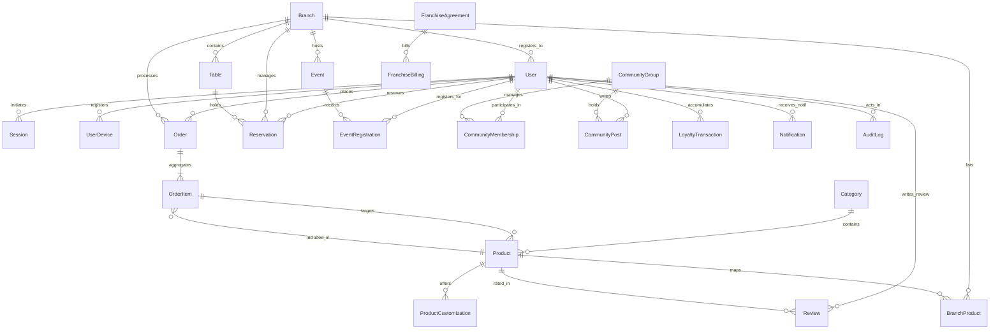

# 🗄️ Database Design & ERD — Warkop Ya'reh Digital Ecosystem

This document provides a comprehensive overview of the database schema, entity-relationship diagrams, multi-branch and franchise tenancy strategy, and Row-Level Security (RLS) policies implemented on top of the PostgreSQL database.

---

## 🗺️ Entity-Relationship Diagram (ERD)

The following Mermaid diagram outlines all 26 tables in the ecosystem and their primary foreign key relationships:



---

## 🏛️ Multi-Branch & Franchise Tenancy Strategy

The Warkop Ya'reh system employs a **hybrid tenant isolation model** designed to support scaling from local branches (Surabaya flagship locations) to multi-franchise groups across Indonesia:

### 1. Tenancy Levels
1. **System-Level (Superadmin)**: Owns global configurations, catalog base templates, system monitoring, and franchise agreements.
2. **Franchise-Level (Tenant)**: Isolated franchise operators with their own staff credentials, billing cycles, custom pricing, and localized branding.
3. **Branch-Level (Sub-tenant)**: Individual physical shops (e.g., Darmo, Dharmahusada) that manage daily order queues, table availability, localized inventory quantities, and specific events.

### 2. Isolation Strategy
- **Shared Schema, Tenant Discriminator Columns**: The database uses single tables (such as `orders`, `users`, etc.) with `branchId` discriminator keys. 
- **Row-Level Security (RLS)**: Enforced via PostgreSQL rules to restrict query operations to the active user's authorized `branchId` or `franchiseId`.

---

## 🔒 Row-Level Security (RLS) Policies

To protect customer profiles and operations data against cross-tenant injection vulnerabilities, PostgreSQL RLS is enabled on all core operational tables.

### Setup Policies Script
```sql
-- Enable Row Level Security
ALTER TABLE "Order" ENABLE ROW LEVEL SECURITY;
ALTER TABLE "Reservation" ENABLE ROW LEVEL SECURITY;
ALTER TABLE "Inventory" ENABLE ROW LEVEL SECURITY;

-- Create policy for Orders
CREATE POLICY branch_isolation_policy ON "Order"
    USING (branchId = current_setting('app.current_branch_id', true))
    WITH CHECK (branchId = current_setting('app.current_branch_id', true));

-- Create policy for Reservations
CREATE POLICY branch_reservation_policy ON "Reservation"
    USING (branchId = current_setting('app.current_branch_id', true))
    WITH CHECK (branchId = current_setting('app.current_branch_id', true));
```

The database connection middleware (`tenant-isolation.interceptor.ts`) executes a transaction local block:
```typescript
await prisma.$executeRawUnsafe(`SET LOCAL app.current_branch_id = '${branchId}'`);
```
This forces all underlying PostgreSQL reads and writes to filter results implicitly by the scoped branch context, matching our design criteria.
