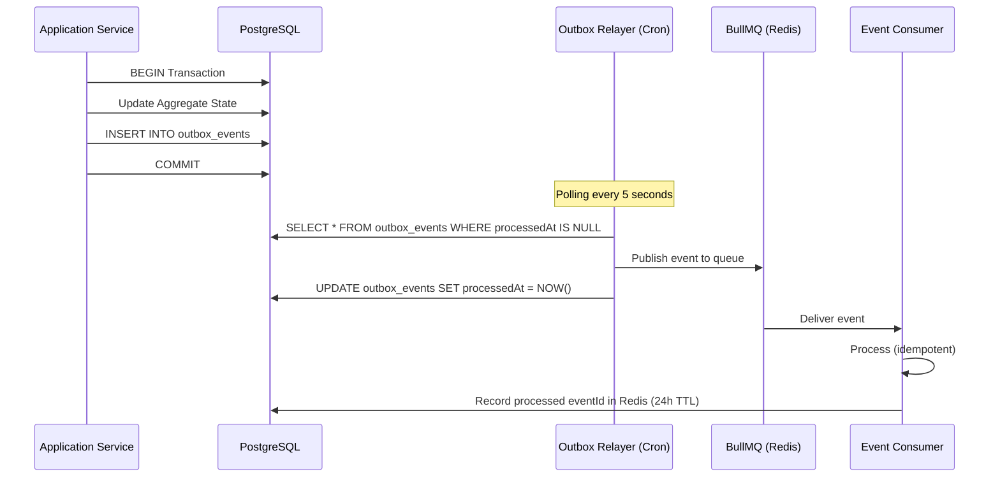
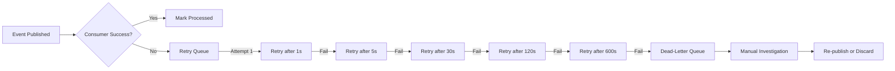

# ⚡ Event-Driven Design — Warkop Ya'reh Digital Ecosystem

## 1. Overview

Warkop Ya'reh employs the **Transactional Outbox Pattern** to guarantee reliable asynchronous event delivery without distributed transactions. Domain events are persisted atomically alongside aggregate state changes, then relayed to consumers via BullMQ workers.

---

## 2. Outbox Pattern Architecture



### 2.1 Outbox Schema

```prisma
model OutboxEvent {
  id            String    @id @default(cuid())
  aggregateType String    // e.g., "Order", "User"
  aggregateId   String    // e.g., "ord_abc123"
  eventType     String    // e.g., "OrderPaid"
  payload       Json      // Full event payload
  createdAt     DateTime  @default(now())
  processedAt   DateTime?

  @@index([processedAt, createdAt])
  @@map("outbox_events")
}
```

### 2.2 Outbox Relayer Service

- **Polling Interval**: 5 seconds (NestJS `@Cron`)
- **Batch Size**: 100 events per poll cycle
- **Transaction Safety**: Fetch + mark-processed within a single DB transaction
- **Idempotency**: Consumer checks Redis for `event:{eventId}` key before processing
- **Dead-Letter Queue**: Failed jobs retry 5× with exponential backoff, then move to `dlq-failed-events`

---

## 3. Domain Events Specification

### 3.1 Event Envelope Format

```typescript
interface DomainEvent<T = unknown> {
  eventId: string;          // Unique event ID (cuid)
  eventType: string;        // e.g., "OrderPaid"
  aggregateType: string;    // e.g., "Order"
  aggregateId: string;      // e.g., "ord_abc123"
  occurredAt: string;       // ISO 8601 timestamp
  version: number;          // Schema version (1)
  payload: T;               // Event-specific data
  metadata: {
    userId?: string;        // Actor who triggered the event
    branchId?: string;      // Branch context
    correlationId: string;  // Request trace ID
  };
}
```

### 3.2 Event Payloads

#### Identity Events

```typescript
// UserRegistered
{ userId: string; email: string; name: string; referredBy?: string; }

// TierUpgraded
{ userId: string; oldTier: MembershipTier; newTier: MembershipTier; }
```

#### Ordering Events

```typescript
// OrderCreated
{ orderId: string; orderNumber: string; userId: string; branchId: string;
  items: Array<{ productId: string; quantity: number; unitPrice: number }>; 
  subtotal: number; tax: number; total: number; }

// OrderPaid
{ orderId: string; userId: string; total: number; paymentMethod: string;
  paymentReference: string; loyaltyPointsEarned: number; }

// OrderStatusChanged
{ orderId: string; oldStatus: OrderStatus; newStatus: OrderStatus; }

// OrderCancelled
{ orderId: string; userId: string; reason?: string; refundAmount: number; }
```

#### Reservation Events

```typescript
// ReservationCreated
{ reservationId: string; userId: string; branchId: string; tableId: string;
  date: string; startTime: string; endTime: string; guestCount: number; }

// ReservationConfirmed
{ reservationId: string; userId: string; tableId: string; }
```

#### Event Events

```typescript
// EventJoined
{ eventId: string; userId: string; ticketCode: string; paidAmount: number; }

// AttendanceMarked
{ eventId: string; userId: string; checkedInAt: string; }
```

#### Loyalty Events

```typescript
// PointsAwarded
{ userId: string; points: number; type: LoyaltyType; 
  description: string; orderId?: string; }

// RewardRedeemed
{ userId: string; rewardId: string; rewardName: string; pointsCost: number; }
```

---

## 4. Event Consumer Mapping

| Queue Name | Event(s) | Consumer | Action |
|:-----------|:---------|:---------|:-------|
| `loyalty-points` | `OrderPaid` | LoyaltyPointsProcessor | Calculate & award points (10pts per IDR 1,000) |
| `loyalty-points` | `EventJoined` | LoyaltyPointsProcessor | Award 50 attendance points |
| `loyalty-points` | `AttendanceMarked` | LoyaltyPointsProcessor | Award 100 bonus check-in points |
| `loyalty-points` | `OrderCancelled` | LoyaltyPointsProcessor | Reverse awarded points |
| `loyalty-tier` | `PointsAwarded` | TierEvaluationProcessor | Evaluate tier upgrade eligibility |
| `notifications` | `OrderPaid` | NotificationProcessor | Send order confirmation |
| `notifications` | `ReservationConfirmed` | NotificationProcessor | Send booking confirmation |
| `notifications` | `TierUpgraded` | NotificationProcessor | Send tier promotion celebration |
| `notifications` | `EventJoined` | NotificationProcessor | Send ticket with QR code |
| `analytics-ingestion` | All events | AnalyticsProcessor | Record metrics in analytics tables |
| `email-queue` | Various | EmailProcessor | Send transactional emails |

---

## 5. Dead-Letter Queue Strategy



- **Max Retries**: 5
- **Backoff**: Exponential (1s → 5s → 30s → 120s → 600s)
- **DLQ Name**: `dlq-failed-events`
- **Monitoring**: Sentry alert on DLQ insertion
- **Retention**: 30 days in DLQ before automatic purge
