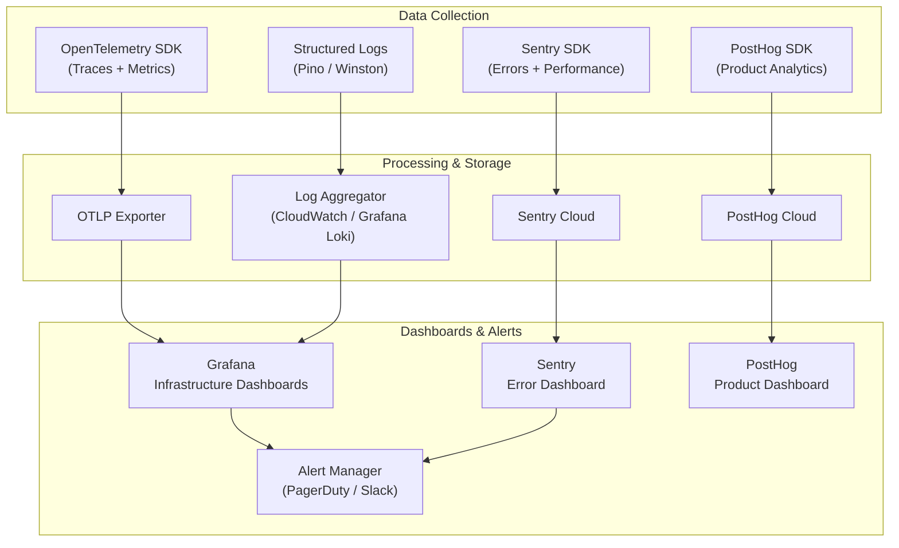

# 📊 Monitoring Architecture — Warkop Ya'reh Digital Ecosystem

## 1. Observability Stack



---

## 2. Metrics

### 2.1 Infrastructure Metrics (OpenTelemetry)

| Metric | Type | Labels | Alert Threshold |
|:-------|:-----|:-------|:----------------|
| `http_request_duration_seconds` | Histogram | method, route, status | p95 > 2s |
| `http_requests_total` | Counter | method, route, status | Error rate > 1% |
| `active_connections` | Gauge | - | > 80% pool |
| `db_query_duration_seconds` | Histogram | operation, table | p95 > 500ms |
| `redis_command_duration_seconds` | Histogram | command | p95 > 100ms |
| `queue_depth` | Gauge | queue_name | > 1000 |
| `queue_processing_duration_seconds` | Histogram | queue_name | p95 > 30s |

### 2.2 Business Metrics (PostHog)

| Metric | Description | Dashboard |
|:-------|:------------|:----------|
| `order_completed` | Successful order checkout | Revenue |
| `signup_completed` | New user registration | Growth |
| `event_registered` | Event ticket purchased | Events |
| `loyalty_points_earned` | Points awarded | Loyalty |
| `community_post_created` | New discussion post | Community |
| `menu_item_viewed` | Product page visit | Catalog |
| `reservation_booked` | Table reservation made | Reservations |

---

## 3. Distributed Tracing

### 3.1 Trace Context Propagation

```
Client Request
  → Cloudflare (X-Request-ID)
    → Next.js Server Action (traceparent header)
      → NestJS API (OpenTelemetry context)
        → PostgreSQL query span
        → Redis command span
        → BullMQ job span
```

### 3.2 Trace Instrumentation

| Layer | Auto-Instrumented | Custom Spans |
|:------|:-------------------|:-------------|
| HTTP | ✅ Express/NestJS routes | Payment processing |
| Database | ✅ Prisma queries | Complex aggregations |
| Redis | ✅ IoRedis commands | Cache hit/miss ratio |
| Queue | ✅ BullMQ jobs | Event processing pipeline |

---

## 4. Structured Logging

### 4.1 Log Format (JSON)

```json
{
  "timestamp": "2026-07-11T14:30:00.000Z",
  "level": "info",
  "message": "Order created successfully",
  "service": "api",
  "traceId": "abc123def456",
  "spanId": "789ghi",
  "userId": "user_xyz",
  "branchId": "branch_darmo",
  "orderId": "ord_001",
  "duration_ms": 145,
  "metadata": {
    "orderTotal": 85000,
    "itemCount": 3
  }
}
```

### 4.2 Log Levels

| Level | Usage | Examples |
|:------|:------|:---------|
| `error` | Unrecoverable failures | Payment gateway timeout, DB connection lost |
| `warn` | Degraded behavior | Cache miss, retry attempt, rate limit hit |
| `info` | Business events | Order created, user registered, event joined |
| `debug` | Development detail | Query params, cache keys, JWT claims |

---

## 5. Alert Rules & Escalation

### 5.1 Critical Alerts (Immediate)

| Alert | Condition | Channel | Escalation |
|:------|:----------|:--------|:-----------|
| **API Down** | Health check fails 3× | Slack + PagerDuty | On-call engineer |
| **Error Rate Spike** | > 5% of requests in 5 min | Slack + PagerDuty | On-call engineer |
| **Database Down** | Connection refused | Slack + PagerDuty | On-call + DBA |
| **Payment Failure** | Midtrans webhook timeout 3× | Slack + PagerDuty | On-call + Finance |

### 5.2 Warning Alerts (Within 1 Hour)

| Alert | Condition | Channel |
|:------|:----------|:--------|
| **High Latency** | p95 > 2s for 10 min | Slack |
| **Queue Backlog** | Depth > 500 for 10 min | Slack |
| **Disk Usage** | > 80% capacity | Slack |
| **DLQ Events** | Any event in dead-letter queue | Slack |
| **Certificate Expiry** | < 14 days remaining | Slack |

### 5.3 Informational (Daily Digest)

| Alert | Condition | Channel |
|:------|:----------|:--------|
| **Daily Error Summary** | Aggregated error count | Email |
| **Dependency Updates** | New Dependabot PRs | Slack |
| **Performance Report** | Weekly p50/p95/p99 trends | Email |

---

## 6. Health Check Endpoints

```typescript
// GET /api/health
{
  "status": "healthy",
  "timestamp": "2026-07-11T14:30:00.000Z",
  "version": "1.0.0",
  "checks": {
    "database": { "status": "up", "latency_ms": 5 },
    "redis": { "status": "up", "latency_ms": 2 },
    "queue": { "status": "up", "depth": 12 }
  }
}

// GET /api/health/ready (Kubernetes readiness probe)
// GET /api/health/live  (Kubernetes liveness probe)
```
