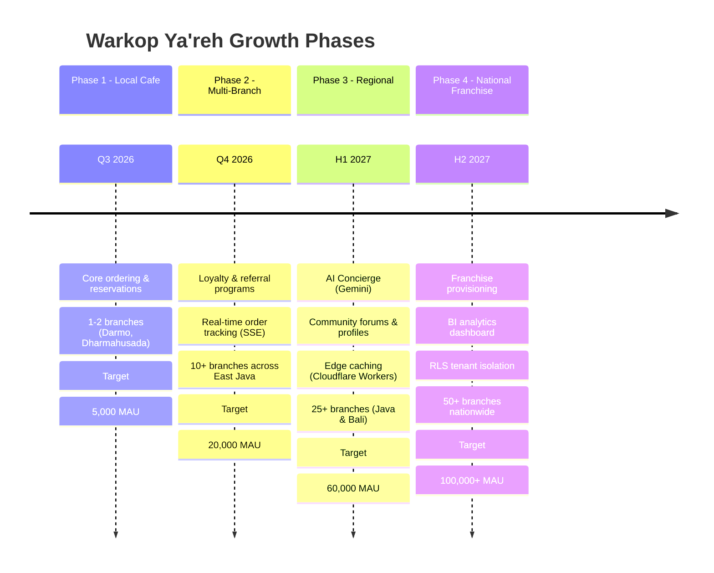
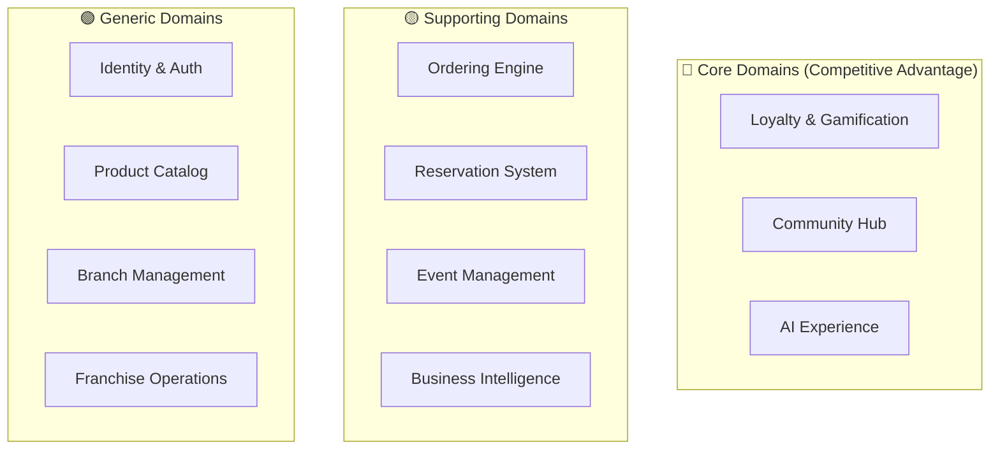

# 🎯 Product Architecture — Warkop Ya'reh Digital Ecosystem

## 1. Product Vision

> **Transform Warkop Ya'reh from a traditional Indonesian coffee shop into a scalable digital ecosystem platform** — unifying customer ordering, community building, event management, loyalty rewards, and franchise operations under a single, enterprise-grade technology backbone designed for 5–10 year growth.

### Vision Statement

*"Setiap cangkir kopi membangun koneksi. Every cup builds connections."*

Warkop Ya'reh is not just a coffee shop — it is a **community-centric lifestyle platform** that combines the warmth of Indonesian "warkop" culture with modern digital experiences tailored for developers, creators, and professionals.

---

## 2. Product Strategy

### 2.1 Growth Model (4-Phase)

### 2.2 Revenue Streams

| Stream | Phase | Model |
|:-------|:------|:------|
| **Digital Orders** | 1+ | Transaction commission per order |
| **Table Reservations** | 1+ | Free (drives foot traffic) |
| **Event Ticketing** | 1+ | Ticket sales + sponsorship |
| **Loyalty Rewards** | 2+ | Points-driven repeat purchases |
| **Franchise Licensing** | 4 | Monthly SaaS licensing fee per branch |
| **AI Upselling** | 3+ | Increased AOV via recommendations |

---

## 3. Product Boundaries

### 3.1 Domain Classification

### 3.2 Domain Ownership Matrix

| Domain | Owner | Priority | Phase |
|:-------|:------|:---------|:------|
| **Identity** | Platform Team | P0 | 1 |
| **Catalog** | Product Team | P0 | 1 |
| **Ordering** | Commerce Team | P0 | 1 |
| **Reservation** | Operations Team | P0 | 1 |
| **Event** | Community Team | P1 | 1 |
| **Loyalty** | Growth Team | P1 | 2 |
| **Community** | Community Team | P1 | 3 |
| **Analytics** | Data Team | P2 | 2 |
| **Branch** | Operations Team | P1 | 2 |
| **Franchise** | Business Team | P2 | 4 |
| **AI** | Platform Team | P2 | 3 |

### 3.3 Integration Touchpoints

| Producer Domain | Event | Consumer Domain(s) |
|:----------------|:------|:--------------------|
| Ordering | `OrderPaid` | Loyalty (award points), Analytics (revenue tracking) |
| Identity | `UserRegistered` | Loyalty (create wallet), Community (welcome notification) |
| Event | `EventJoined` | Loyalty (award attendance points), Analytics |
| Loyalty | `TierUpgraded` | Identity (update tier), Notification |
| Reservation | `ReservationConfirmed` | Branch (update capacity), Notification |
| Community | `PostCreated` | Analytics (engagement tracking) |
