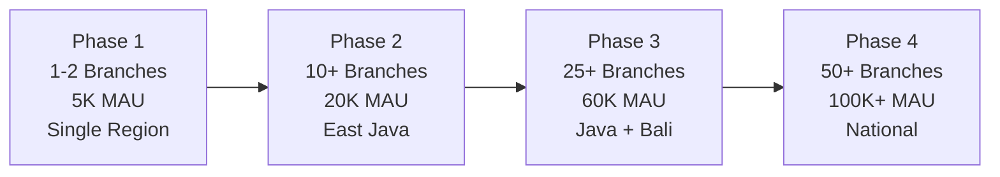
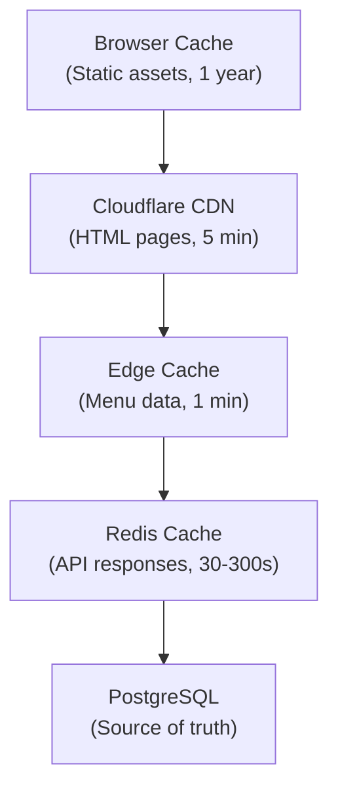

# 📈 Scalability Strategy — Warkop Ya'reh Digital Ecosystem

## 1. Scaling Phases



---

## 2. Infrastructure Per Phase

### Phase 1: Single Branch (Q3 2026)

| Component | Configuration | Cost Tier |
|:----------|:-------------|:----------|
| **Web** | Vercel Hobby/Pro (1 project) | ~$20/mo |
| **API** | ECS Fargate (1 task, 0.5 vCPU, 1GB) | ~$30/mo |
| **Database** | Neon Free (0.5 CU, 3GB) | Free |
| **Redis** | Upstash Free (10K commands/day) | Free |
| **CDN** | Cloudflare Free | Free |
| **Monitoring** | Sentry Developer, PostHog Free | Free |

**Total estimated**: ~$50/month

### Phase 2: Multi-Branch (Q4 2026)

| Component | Configuration | Upgrade From Phase 1 |
|:----------|:-------------|:---------------------|
| **Web** | Vercel Pro (2 projects: web + admin) | ✅ Add admin |
| **API** | ECS Fargate (2 tasks, 1 vCPU, 2GB each) | ✅ Scale horizontally |
| **Database** | Neon Scale (4 CU, 10GB, autoscaling) | ✅ Upgrade tier |
| **Redis** | Upstash Pay-as-you-go (100K commands/day) | ✅ Upgrade tier |
| **CDN** | Cloudflare Pro | ✅ Add WAF rules |
| **Queue** | BullMQ (3 workers) | ✅ Add workers |

**Total estimated**: ~$200/month

### Phase 3: Regional (H1 2027)

| Component | Configuration | Upgrade From Phase 2 |
|:----------|:-------------|:---------------------|
| **API** | ECS Fargate (4 tasks with auto-scaling) | ✅ Auto-scaling policies |
| **Database** | Neon Scale (8 CU) + Read replica | ✅ Add read replicas |
| **Redis** | Upstash Pro (dedicated, multi-region) | ✅ Multi-region |
| **Edge** | Cloudflare Workers (menu cache) | ✅ Edge caching layer |
| **AI** | Google Gemini API (Jakarta region) | ✅ New service |
| **Storage** | Cloudflare R2 (50GB) | ✅ Media storage |

**Total estimated**: ~$500/month

### Phase 4: National Franchise (H2 2027)

| Component | Configuration | Upgrade From Phase 3 |
|:----------|:-------------|:---------------------|
| **API** | ECS Fargate (8+ tasks, multi-AZ) | ✅ HA deployment |
| **Database** | Neon Business (16 CU) + RLS enforcement | ✅ Tenant isolation |
| **Redis** | Upstash Enterprise | ✅ SLA guarantee |
| **CDN** | Cloudflare Business | ✅ Advanced WAF |
| **Monitoring** | Grafana Cloud + Sentry Business | ✅ Full observability |

**Total estimated**: ~$1,500/month

---

## 3. Caching Strategy

### 3.1 Cache Layers



### 3.2 Cache Keys & TTL

| Data Type | Cache Key Pattern | TTL | Invalidation |
|:----------|:------------------|:----|:-------------|
| **Menu (branch)** | `menu:{branchId}` | 5 min | On product update event |
| **Product detail** | `product:{productId}` | 10 min | On product update event |
| **User profile** | `user:{userId}` | 5 min | On profile update |
| **Branch info** | `branch:{branchId}` | 30 min | On branch update |
| **Leaderboard** | `leaderboard:{branchId}:{period}` | 15 min | Periodic refresh |
| **Analytics (daily)** | `analytics:{branchId}:{date}` | 1 hour | End-of-day flush |
| **Rate limit** | `ratelimit:{key}:{window}` | Window duration | Auto-expire |
| **Session** | `session:{tokenHash}` | 7 days | On logout/rotation |

---

## 4. Multi-Tenant Architecture

### 4.1 Strategy: Shared Database, Shared Schema + RLS

```
Phase 1-2: Application-level tenant filtering (WHERE branchId = ?)
Phase 3:   Optional RLS policies on staging environments
Phase 4:   Mandatory RLS enforcement globally in production
```

### 4.2 RLS Policy Example

```sql
-- Enable RLS on orders table
ALTER TABLE orders ENABLE ROW LEVEL SECURITY;

-- Branch staff can only see their branch's orders
CREATE POLICY branch_isolation ON orders
    FOR ALL
    USING (branch_id = current_setting('app.current_branch_id')::text);

-- Admins can see all orders
CREATE POLICY admin_access ON orders
    FOR ALL
    TO admin_role
    USING (true);
```

---

## 5. Database Scaling Strategy

| Phase | Strategy | Details |
|:------|:---------|:--------|
| 1 | Single writer | Neon serverless, auto-sleep |
| 2 | Single writer + connection pooling | PgBouncer (Neon built-in) |
| 3 | Writer + read replicas | Analytics queries → replica |
| 4 | Writer + replicas + partitioning | Partition `orders` by `created_at` (monthly) |

---

## 6. Horizontal Scaling Triggers

| Metric | Threshold | Action |
|:-------|:----------|:-------|
| CPU utilization | > 70% sustained 5 min | Scale out +1 API task |
| Memory utilization | > 80% | Scale out +1 API task |
| Request latency (p95) | > 2 seconds | Scale out + investigate |
| Queue depth | > 1000 pending jobs | Scale out +1 worker |
| DB connections | > 80% pool capacity | Increase pool size |
| Error rate | > 1% of requests | Alert + investigate |
