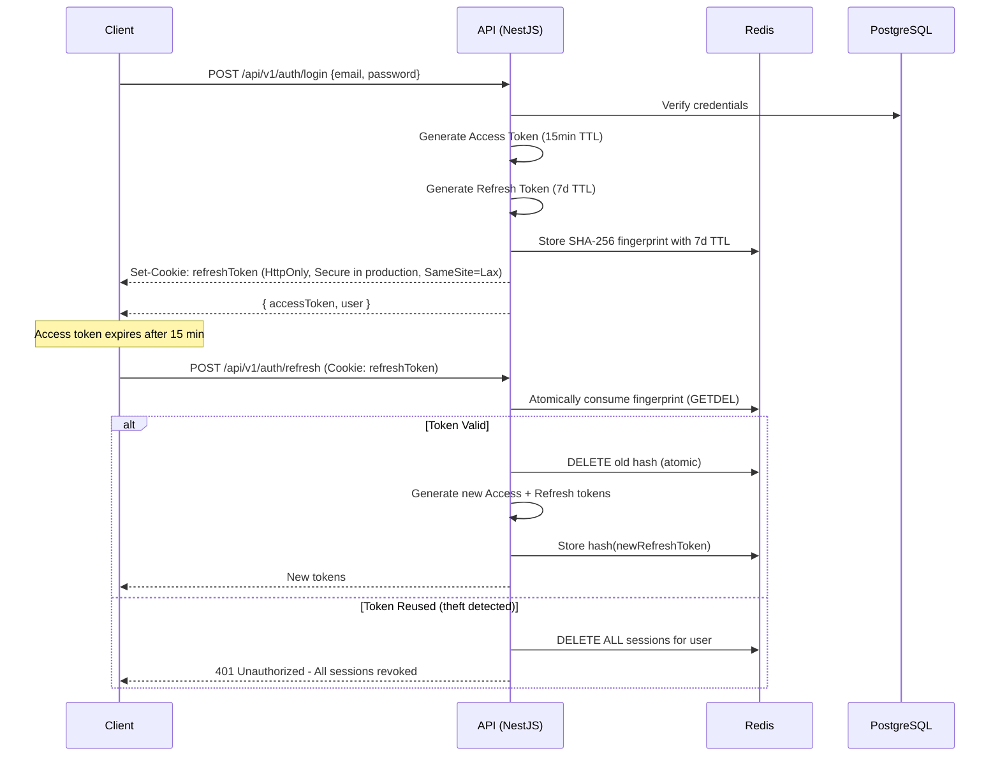
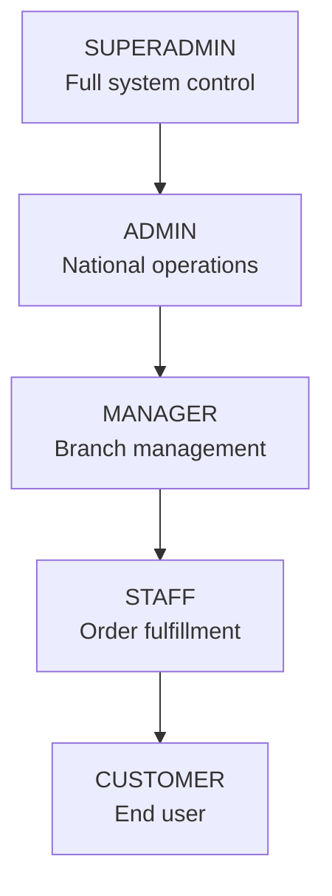

# 🔒 Security Architecture — Warkop Ya'reh Digital Ecosystem

> **Status:** Security target and control map. The authentication details below match current source; remaining compliance rows require independent release verification.

## 1. Authentication Flow

### 1.1 JWT + Refresh Token Rotation



### 1.2 Token Specifications

| Token         | Algorithm | TTL    | Storage                               | Contains            |
| :------------ | :-------- | :----- | :------------------------------------ | :------------------ |
| Access Token  | HS256 JWT | 15 min | Session memory + Authorization header | userId, email, role |
| Refresh Token | HS256 JWT | 7 days | HttpOnly cookie                       | userId, email, role |

---

## 2. RBAC (Role-Based Access Control)

### 2.1 Role Hierarchy



### 2.2 Permission Matrix

| Resource                    | CUSTOMER | STAFF     | MANAGER         | ADMIN     | SUPERADMIN |
| :-------------------------- | :------- | :-------- | :-------------- | :-------- | :--------- |
| **Menu (read)**             | ✅       | ✅        | ✅              | ✅        | ✅         |
| **Menu (write)**            | ❌       | ❌        | ✅ (own branch) | ✅        | ✅         |
| **Orders (own)**            | ✅       | ✅        | ✅              | ✅        | ✅         |
| **Orders (branch)**         | ❌       | ✅ (read) | ✅              | ✅        | ✅         |
| **Orders (all)**            | ❌       | ❌        | ❌              | ✅        | ✅         |
| **Order status update**     | ❌       | ✅        | ✅              | ✅        | ✅         |
| **Reservations (own)**      | ✅       | ❌        | ✅              | ✅        | ✅         |
| **Reservations (branch)**   | ❌       | ✅        | ✅              | ✅        | ✅         |
| **Events (read)**           | ✅       | ✅        | ✅              | ✅        | ✅         |
| **Events (write)**          | ❌       | ❌        | ✅              | ✅        | ✅         |
| **Event check-in**          | ❌       | ✅        | ✅              | ✅        | ✅         |
| **Community (participate)** | ✅       | ✅        | ✅              | ✅        | ✅         |
| **Community (moderate)**    | ❌       | ❌        | ✅              | ✅        | ✅         |
| **Loyalty (own)**           | ✅       | ❌        | ❌              | ✅        | ✅         |
| **Loyalty (admin)**         | ❌       | ❌        | ❌              | ✅        | ✅         |
| **Analytics (branch)**      | ❌       | ❌        | ✅              | ✅        | ✅         |
| **Analytics (all)**         | ❌       | ❌        | ❌              | ✅        | ✅         |
| **Branch management**       | ❌       | ❌        | ✅ (own)        | ✅        | ✅         |
| **User management**         | ❌       | ❌        | ❌              | ✅        | ✅         |
| **Franchise admin**         | ❌       | ❌        | ❌              | ❌        | ✅         |
| **System config**           | ❌       | ❌        | ❌              | ❌        | ✅         |
| **Audit logs**              | ❌       | ❌        | ❌              | ✅ (read) | ✅         |

### 2.3 Implementation

```typescript
// roles.decorator.ts
export const Roles = (...roles: Role[]) => SetMetadata('roles', roles);

// Usage in controller
@Post('products')
@Roles(Role.MANAGER, Role.ADMIN, Role.SUPERADMIN)
createProduct(@Body() dto: CreateProductDto) { ... }
```

---

## 3. Audit Logging

### 3.1 Strategy

All database mutations are automatically logged via a NestJS interceptor and PostgreSQL triggers:

| Layer       | Mechanism             | Coverage                                     |
| :---------- | :-------------------- | :------------------------------------------- |
| Application | `AuditLogInterceptor` | All API mutations (POST, PUT, PATCH, DELETE) |
| Database    | PostgreSQL triggers   | Direct DB changes (seed scripts, migrations) |

### 3.2 Audit Log Schema

```prisma
model AuditLog {
  id        String   @id @default(cuid())
  userId    String?
  action    String   // CREATE, UPDATE, DELETE
  entity    String   // Table name (e.g., "orders")
  entityId  String?  // Row ID
  details   Json?    // Before/after snapshot
  ipAddress String?
  userAgent String?
  createdAt DateTime @default(now())

  @@index([userId])
  @@index([entity, entityId])
  @@index([createdAt])
  @@map("audit_logs")
}
```

### 3.3 Immutability

- Application code has **no DELETE or UPDATE** access to the `audit_logs` table
- PostgreSQL trigger enforces immutability: `BEFORE UPDATE OR DELETE ON audit_logs → RAISE EXCEPTION`

---

## 4. Rate Limiting

### 4.1 Tiers

| Tier              | Rate         | Window     | Applies To                              |
| :---------------- | :----------- | :--------- | :-------------------------------------- |
| **Anonymous**     | 30 requests  | 1 minute   | Unauthenticated endpoints               |
| **Authenticated** | 120 requests | 1 minute   | Authenticated endpoints                 |
| **Admin**         | 300 requests | 1 minute   | Admin API endpoints                     |
| **Webhook**       | 60 requests  | 1 minute   | Payment callbacks                       |
| **Auth**          | 5 attempts   | 15 minutes | Login/register (brute-force protection) |

### 4.2 Implementation

- **Algorithm**: Sliding window counter (Redis-backed)
- **Key**: `rate_limit:{userId || ip}:{endpoint_group}`
- **Response**: `429 Too Many Requests` with `Retry-After` header

---

## 5. CORS Policy

```typescript
app.enableCors({
  origin: [
    'https://warkop-yareh.com',
    'https://admin.warkop-yareh.com',
    process.env.NODE_ENV === 'development' && 'http://localhost:3000',
    process.env.NODE_ENV === 'development' && 'http://localhost:3001',
  ].filter(Boolean),
  credentials: true,
  allowedHeaders: ['Content-Type', 'Authorization', 'x-branch-id'],
  maxAge: 86400, // 24 hours preflight cache
});
```

---

## 6. Secrets Management

| Secret                                | Storage                           | Rotation               |
| :------------------------------------ | :-------------------------------- | :--------------------- |
| `DATABASE_URL`                        | Environment variable (Vercel/ECS) | On credential rotation |
| `REDIS_URL`                           | Environment variable              | On credential rotation |
| `JWT_SECRET` and `JWT_REFRESH_SECRET` | Managed deployment secrets        | 90 days                |
| `MIDTRANS_SERVER_KEY`                 | Environment variable              | Per Midtrans policy    |
| `SENTRY_DSN`                          | Environment variable              | Static                 |
| `POSTHOG_KEY`                         | Environment variable (public)     | Static                 |

---

## 7. OWASP Compliance Checklist

| #   | Control                   | Implementation                                                             |
| :-- | :------------------------ | :------------------------------------------------------------------------- |
| A01 | Broken Access Control     | RBAC guards + tenant isolation interceptor                                 |
| A02 | Cryptographic Failures    | bcrypt password hashing, HTTPS only, separate HS256 access/refresh secrets |
| A03 | Injection                 | Prisma parameterized queries, Zod input validation                         |
| A04 | Insecure Design           | DDD bounded contexts, principle of least privilege                         |
| A05 | Security Misconfiguration | Strict CORS, rate limiting, security headers                               |
| A06 | Vulnerable Components     | Dependabot alerts, monthly dependency audits                               |
| A07 | Auth Failures             | Refresh token rotation, session revocation on reuse                        |
| A08 | Data Integrity            | Audit logs, OutboxEvent pattern, DB triggers                               |
| A09 | Logging Failures          | Structured logging, Sentry integration                                     |
| A10 | SSRF                      | Input validation on all URLs, allowlisted external hosts                   |
