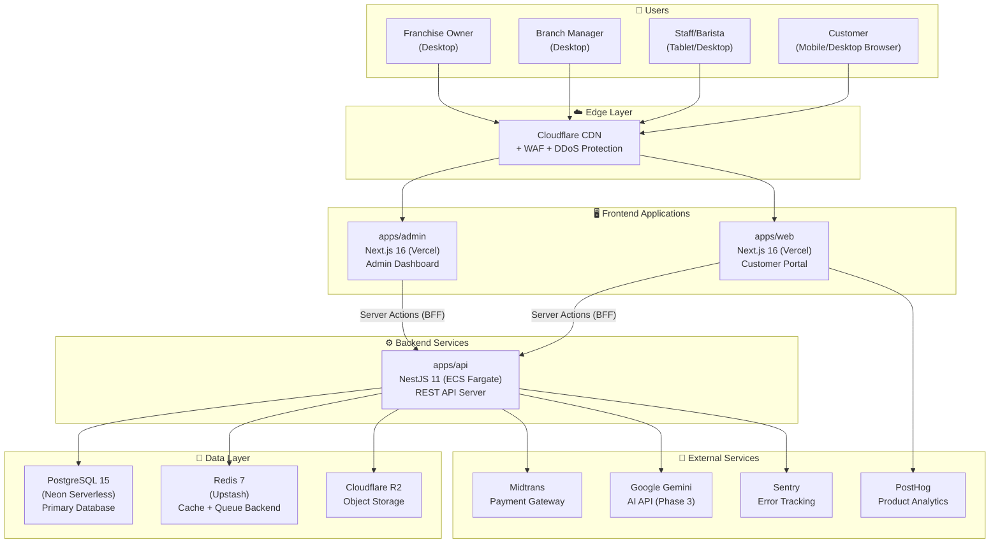
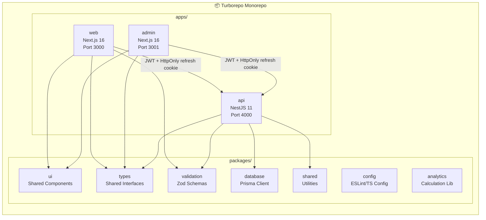
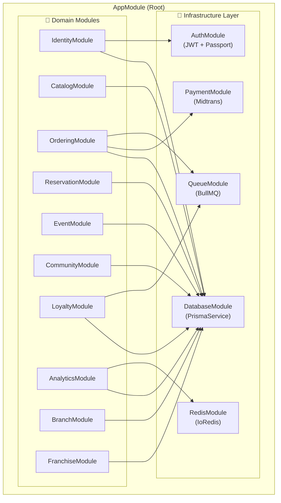
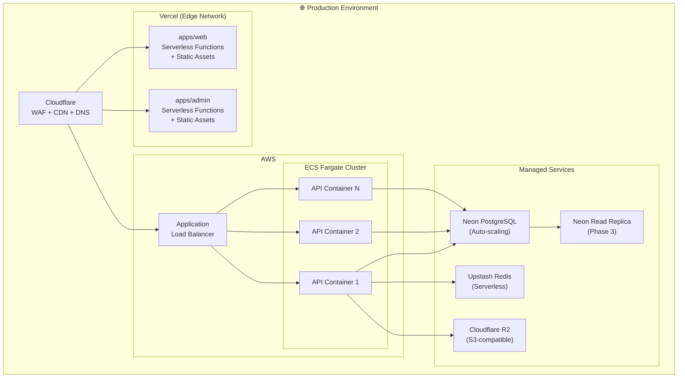
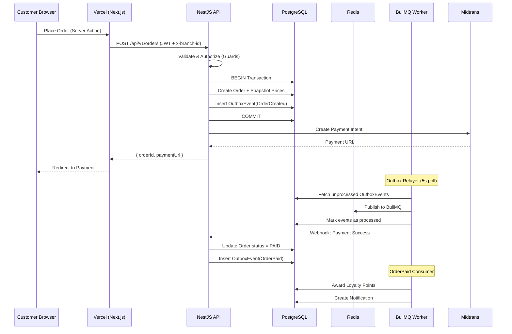

# 🏛️ System Architecture — Warkop Ya'reh Digital Ecosystem

> **Status:** Source-aligned architecture plus target deployment topology. Provider-specific infrastructure in this document requires separate staging/production evidence.

## 1. High-Level Architecture (C4 Context Diagram)

---

## 2. Container Diagram

---

## 3. Component Diagram (NestJS Modules)

---

## 4. Deployment Diagram

---

## 5. Data Flow Architecture

